# Component Stamps

In this section we will explore each of the available component stamps found in JoSIM. This will serve as insight into how BDF2 method is applied to produce time dependent voltage or phase equations for each component.

This will serve as a continuation of what was shown in the [Technical Discussion](tech_disc.md) section for the Capacitor.

### Resistor

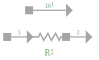

A resistor is a passive circuit element for which the voltage dependent equation is defined through Ohm's law:

$$
v(t) = i_{R_{1}}(t) R_{1}
$$

$$
V_{n}-R_{1}I_{R_{1}} = 0
$$

This can then be written as a matrix stamp in the form

$$
\begin{bmatrix}
0 & 0 & 1 \\
0 & 0 & -1 \\
1 & -1 & -R_{1}
\end{bmatrix}
\begin{bmatrix}
V^{+} \\
V^{-}\\
I_{R_{1}}
\end{bmatrix}
=
\begin{bmatrix}
0\\
0\\
0 
\end{bmatrix}
$$

If we expand this using the voltage-phase relation shown in [Technical Discussion](tech_disc.md), then we can rewrite the equation as:

$$
\frac{\Phi_{0}}{2\pi}\frac{d\phi}{dt}_{n}\frac{1}{R_{1}} = I_{R_{1}}
$$

This equation will now require the application of the BDF2 method:

$$
\frac{\Phi_{0}}{2\pi R_{1}}\frac{3}{2h}\left[\phi_n - \frac{4}{3}\phi_{n-1} + \frac{1}{3}\phi_{n−2}\right] = {I_{R_{1}}}
$$

$$
\phi_n - \frac{2\pi R_{1}}{\Phi_0}\frac{2h}{3}I_{R_{1}} =\frac{4}{3}\phi_{n-1} - \frac{1}{3}\phi_{n−2}
$$

This allows us to create a phase resistor matrix stamp as:

$$
\begin{bmatrix}
0 & 0 & 1 \\
0 & 0 & -1 \\ 
1 & -1 &  - \frac{2\pi R_{1}}{\Phi_0}\frac{2h}{3}
\end{bmatrix}
\begin{bmatrix}
\phi_{1} \\
\phi_{2} \\ I_{R_{1}}
\end{bmatrix}
=
\begin{bmatrix}
0\\
0 \\  
\frac{4}{3}\phi_{n-1} - \frac{1}{3}\phi_{n−2}
\end{bmatrix}
$$

### Inductor

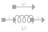

A inductor is defined in terms of voltage and current as:

$$
v(t)=L_{1}\frac{di}{dt}
$$

This is a first order differential and needs to be expanded using the BDF2 method:

$$
V_{n} = \frac{3L_{1}}{2h}\left[I_{n}-\frac{4}{3}I_{n-1}+\frac{1}{3}I_{n-2}\right]
$$

$$
V_{n}-\frac{3L_{1}}{2h}I_{n}=-\frac{2L_{1}}{h}I_{n-1}+\frac{L_{1}}{2h}I_{n-2}
$$

This allows us to create the inductor stamp as:

$$
\begin{bmatrix}
0 & 0 & 1 \\
0 & 0 & -1 \\
1 & -1 &  -\frac{3L_{1}}{2h}
\end{bmatrix}
\begin{bmatrix}
V^{+} \\
V^{-} \\
I_{L_{1}}
\end{bmatrix}
=
\begin{bmatrix}
0 \\
0 \\
-\frac{2L_{1}}{h}I_{n-1}+\frac{L_{1}}{2h}I_{n-2}
\end{bmatrix}
$$

The MNPA stamp for the inductor is derived by substituting the voltage-phase relation.

$$
\frac{\Phi_{0}}{2\pi}\frac{d\phi}{dt}=L_{1}\frac{di}{dt}
$$

With derivatives on both sides, we can integrate with respect to time on both sides:

$$
\int\frac{\Phi_{0}}{2\pi}\frac{d\phi}{dt}=\int L_{1}\frac{di}{dt}
$$

$$
\frac{\Phi_{0}}{2\pi}\phi_{n}=L_{1}I_{n}
$$

$$
\phi_{n} - \frac{2\pi}{\Phi_{0}}L_{1}I_{n} = 0
$$

Which leads to the extremely simplistic inductor MNPA stamp matrix:

$$
\begin{bmatrix}
0 & 0 & 1 \\
0 & 0 & -1 \\ 
1 & -1 &  - \frac{2\pi}{\Phi_{0}}L_{1}
\end{bmatrix}
\begin{bmatrix}
\phi^{+} \\
\phi^{-} \\ 
I_{L_{1}}
\end{bmatrix}
=
\begin{bmatrix}
0\\
0 \\ 
0
\end{bmatrix}
$$

### Josephson Junction

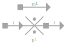

The Josephson junction above is a simplification of the resistively and capacitively shunted junction (RCSJ) model implemented in JoSIM. This model sums the current through the 3 parallel branches and is represented by the following equation:

$$
I_{B_{1}} = I_c \sin{\phi} + \frac{V_{n}}{R_{B_{1}}} + C_{B_{1}}\frac{dV_{n}}{dt}
$$

Which when expanded with the BDF2 method becomes:

$$
I_{B_{1}} = I_{c}\sin\phi+\frac{V_{n}}{R_{B_{1}}}+\frac{3C_{B_{1}}}{2h}\left[V_{n}-\frac{4}{3}V_{n-1}+\frac{1}{3}V_{n-2}\right]
$$

$$
\frac{V_{n}}{R_{B_{1}}}+ \frac{3C_{B_{1}}}{2h}V_{n} - I_{B_{1}} = -I_{c}\sin\phi+\frac{3C_{B_{1}}}{2h}\frac{4}{3}V_{n-1}-\frac{3C_{B_{1}}}{2h}\frac{1}{3}V_{n-2}
$$

$$
V_{n}-\frac{2hR_{B_{1}}}{2h+3C_{B_{1}}R_{B_{1}}}I_{B_{1}}=\frac{2hR_{B_{1}}}{2h+3C_{B_{1}}R_{B_{1}}}\left[I_{c}\sin\phi-\frac{2C_{B_{1}}}{h}V_{n-1}+\frac{C_{B_{1}}}{2h}V_{n-2}\right]
$$

This equation depends on the phase at the present time step, which needs to be solved. Phase is not, however, solved and we therefore need to use the voltage-phase relationship to find a voltage dependent solution for the phase:

$$
V_{n} = \frac{\Phi_0}{2\pi}{\frac{d\phi}{dt}}_{n}
$$

$$
V_{n} = \frac{\Phi_{0}}{2\pi}\frac{3}{2h}\left[\phi_{n}-\frac{4}{3}\phi_{n-1}+\frac{1}{3}\phi_{n-2}\right]
$$

$$
V_{n}-\frac{\Phi_{0}}{2\pi}\frac{3}{2h}\phi_n=-\frac{\Phi_{0}}{2\pi}\frac{2}{h}\phi_{n-1}+\frac{\Phi_{0}}{2\pi}\frac{1}{h}\phi_{n-2}
$$

We can now combine these two equations to form the component stamp matrix:

$$
\begin{bmatrix}
0 & 0 & 0 & 1 \\
0 & 0 & 0 & -1 \\
1 & -1 & -\frac{\Phi_{0}}{2\pi}\frac{3}{2h} & 0 \\ 
1 & -1 & 0 & -\frac{2hR_{B_{1}}}{2h+3C_{B_{1}}R_{B_{1}}}
\end{bmatrix}
\begin{bmatrix}
V^{+} \\
V^{-} \\ 
\phi_{n}\\
I_{B_{1}}
\end{bmatrix}
=
\begin{bmatrix}
0 \\
0 \\
-\frac{\Phi_{0}}{2\pi}\frac{2}{h}\phi_{n-1}+\frac{\Phi_{0}}{2\pi}\frac{1}{h}\phi_{n-2} \\
I_{s} 
\end{bmatrix}
$$

Where $I_{s} = \frac{2hR_{B_{1}}}{2h+3C_{B_{1}}R_{B_{1}}}\left[I_{c}\sin\phi-\frac{2C_{B_{1}}}{h}V_{n-1}+\frac{C_{B_{1}}}{2h}V_{n-2}\right]$

It is, however, not possible to use the phase value for the current time step in the calculation of the current time step, we therefore have to rely on an estimated phase value based on previous values.

We define this estimation as:

$$
\phi_{n}^{0} =\frac{4}{3}\phi_{n-1}-\frac{1}{3}\phi_{n-2}+ \frac{2\pi}{\Phi_{0}}\frac{2h}{3}V_{n}^{0}
$$

$$
V_{n}^{0} = V_{n-1} + h\frac{dV}{dt}_{n-1}
$$

$$
V_{n}^{0}=V_{n-1}+\frac{3}{2}V_{n-1}-2V_{n-2}+\frac{1}{2}V_{n-3}
$$

$$
V_{n}^{0}=\frac{5}{2}V_{n-1}-2V_{n-2}+\frac{1}{2}V_{n-3}
$$

The current phase case is rather basic and we therefore replace the supercurrent term with the more general term defined by Haberkorn[^1]:

$$
I_c\sin\phi = \frac{\pi\Delta}{2eR_N}\frac{\sin{\phi}}{\sqrt{1 - \overline{D}\sin^2\left(\frac{\phi}{2}\right)}}\tanh\left[\frac{\Delta}{2k_BT}\sqrt{1-\overline{D}\sin^2\left(\frac{\phi}{2}\right)}\right]
$$

This equation introduces temperature dependence within the junction model through $\Delta$:

$$
\Delta_0 = 1.76k_BT_c​
$$

$$
\Delta = \Delta_0\sqrt{\cos\left[\frac{\pi}{2}\left(\frac{T}{T_c}\right)^2\right]}
$$

with $T$, the boiling point of liquid Helium (4.2K), $T_{c}$ the critical temperature of Niobium (9.1K) and $k_{B}$ is Boltzmann's constant for average kinetic energy of particles.

The resistance value $R_{N}$ is defined as:

$$
R_N = \frac{\pi\Delta}{2eI_c}\tanh\left(\frac{\Delta}{2k_{B}T}\right)
$$

This allows us to change the characteristics of the tunnel current by simply altering the transparency value \(\overline{D}\). For values of $\overline{D} \ll 1$ the equation becomes the normal sinusoidal equation whereas for large values of $\overline{D}$ it becomes the non-sinusoidal ballistic tunneling equation.

To define the Josephson junction in phase we simply swap the voltage and phase of the component previously identified. The equations remain mostly the same since the Josephson junction is already a phase element.

$$
\begin{bmatrix}
0 & 0 & 0 & 1 \\
0 & 0 & 0 & -1 \\
1 & -1 & -\frac{2\pi}{\Phi_{0}}\frac{2h}{3} & 0 \\ 
0 & 0 & 1 & -\frac{2hR_{B_{1}}}{2h+3C_{B_{1}}R_{B_{1}}}	
\end{bmatrix}
\begin{bmatrix}
\phi^{+} \\
\phi^{-} \\ 
V_{n}\\
I_{B_{1}}
\end{bmatrix}
=
\begin{bmatrix}
0 \\
0 \\
\frac{4}{3}\phi_{n-1} - \frac{1}{3}\phi_{n-2} \\
I_{s} 
\end{bmatrix}
$$

### Voltage Source

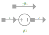

A voltage source is nothing more than is implied. It is a source of voltage, this indicates that the voltage at any time step is known. We can therefore easily create a component stamp matrix in the form:

$$
\begin{bmatrix}
0 & 0 & 1 \\
0 & 0 & -1 \\ 
1 & -1 & 0	
\end{bmatrix}
\begin{bmatrix}
V^{+} \\
V^{-} \\ 
I_{V_{1}}
\end{bmatrix}
=
\begin{bmatrix}
0\\
0 \\ 
V_{1}
\end{bmatrix}
$$

The phase version of this element simply sees the voltage replaced with the voltage-phase relation:

$$
\begin{bmatrix}
0 & 0 & 1 \\
0 & 0 & -1 \\ 
1 & -1 & 0	
\end{bmatrix}
\begin{bmatrix}
\phi_{+} \\
\phi_{-} \\ 
I_{V_{1}}
\end{bmatrix}
=
\begin{bmatrix}
0\\
0 \\ 
\frac{4}{3}\phi_{n-1}-\frac{1}{3}\phi_{n-2}+ \frac{2\pi}{\Phi_{0}}\frac{2h}{3}V_{n}
\end{bmatrix}
$$

### Current Source

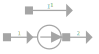

A current source is, as implied, a current that is known at every time step in the simulation. It can therefore simply be applied where needed on the RHS.

$$
\begin{bmatrix}
0 & 0  \\
0 & 0 	
\end{bmatrix}
\begin{bmatrix}
V^{+} \\
V^{-}
\end{bmatrix}
=
\begin{bmatrix}
-I_{1}\\
I_{1}
\end{bmatrix}
$$

### Phase Source

Like a voltage source, simply applies a phase where needed within the circuit.

$$
\begin{bmatrix}
0 & 0 & 1 \\
0 & 0 & -1 \\ 
1 & -1 & 0	
\end{bmatrix}
\begin{bmatrix}
\phi^{+} \\
\phi^{-} \\ 
I_{\phi}
\end{bmatrix}
=
\begin{bmatrix}
0\\
0 \\ 
\phi_{n}
\end{bmatrix}
$$

When voltage mode is used for analysis, this device transforms into a voltage source with the following stamp:

$$
\begin{bmatrix}
0 & 0 & 1 \\
0 & 0 & -1 \\ 
1 & -1 & 0	
\end{bmatrix}
\begin{bmatrix}
V^{+} \\
V^{-} \\ 
I_{\phi}
\end{bmatrix}
=
\begin{bmatrix}
0\\
0 \\ 
\frac{\Phi_{0}}{2\pi}\frac{3}{2h}\left[\phi_{n}-\frac{4}{3}\phi_{n-1}+\frac{1}{3}\phi_{n-2}\right]
\end{bmatrix}
$$

### Transmission Line

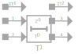

A transmission line is, at present, simply a delay element where the delay ($T_{D}$) and impedance ($Z_{0}$) define the length of the transmission line.

At present we model the transmission line as an ideal element without any losses. We will in future implement a more accurate model of the transmission line.

The equations that govern this lossless transmission line are:

$$
V_1(t) = Z_{0}I_{T_{1}} + Z_{0}I_{T_{2}}(t − T_{D}) + V_2(t − T_{D})
$$

$$
V_2(t) = Z_{0}I_{T_{2}} + Z_{0}I_{T_{1}}(t − T_{D}) + V_1(t − T_{D})
$$

which leads to

$$
(V_{1})_{n} - Z_{0}(I_{T_{1}})_{n} = Z_{0}(I_{T_{2}})_{n-k} + (V_{2})_{n-k}
$$

$$
(V_{2})_{n} - Z_{0}(I_{T_{2}})_{n} = Z_{0}(I_{T_{1}})_{n-k} + (V_{1})_{n-k}
$$

where

$$
k=\frac{T_D}{h}
$$

Which allows us to create a component stamp matrix

$$
\begin{bmatrix}
0 & 0 & 0 & 0 & 1 & 0 \\
0 & 0 & 0 & 0 & -1 & 0 \\
0 & 0 & 0 & 0 & 0 & 1 \\
0 & 0 & 0 & 0 & 0 & -1 \\
1 & -1 & 0 & 0 & -Z_{0} & 0 \\
0 & 0 & 1 & -1 & 0 & -Z_{0}
\end{bmatrix}
\begin{bmatrix}
V_{1}^{+} \\
V_{1}^{-} \\
V_{2}^{+} \\
V_{2}^{-} \\
I_{T_{1}} \\
I_{T_{2}} \\
\end{bmatrix}
=
\begin{bmatrix}
0 \\
0 \\
0 \\
0 \\
Z_{0}(I_{T_{2}})_{n-k} + (V_{2})_{n-k} \\
Z_{0}(I_{T_{1}})_{n-k} + (V_{1})_{n-k}
\end{bmatrix}
$$

We only expand the first equation of the transmission line in phase for simplicity:

$$
\frac{\Phi_{0}}{2\pi}\frac{d\phi_{1}}{dt} = Z_{0}(I_{T_{1}})_{n} + Z_{0}(I_{T_{2}})_{n-k} + \frac{\Phi_{0}}{2\pi}\frac{d\phi_2}{dt}_{n-k}
$$

$$
\frac{\Phi_{0}}{2\pi}\left[\frac{3}{2h}(\phi_{1})_{n} - \frac{2}{h}(\phi_{1})_{n-1} + \frac{1}{2h}{\phi_{1}}_{n-2}\right] = Z_{0}(I_{T_{1}})_{n} + Z_{0}(I_{T_{2}})_{n-k} + \frac{\Phi_{0}}{2\pi}\left[\frac{3}{2h}(\phi_{2})_{n-k} - \frac{2}{h}(\phi_{2})_{n-k-1} + \frac{1}{2h}(\phi_{2})_{n-k-2}\right]
$$

$$
\frac{3}{2h}(\phi_{1})_{n} - \frac{2}{h}(\phi_{1})_{n-1} + \frac{1}{2h}(\phi_{1})_{n-2} = \frac{2\pi}{\Phi_{0}}Z_{0}(I_{T_{1}})_{n} + \frac{2\pi}{\Phi_{0}}Z_{0}(I_{T_{2}})_{n-k} + \frac{3}{2h}(\phi_{2})_{n-k} - \frac{2}{h}(\phi_{2})_{n-k-1} + \frac{1}{2h}(\phi_{2})_{n-k-2}
$$

$$
(\phi_{1})_{n} - \frac{2h}{3}\frac{2}{h}(\phi_{1})_{n-1} + \frac{2h}{3}\frac{1}{2h}(\phi_{1})_{n-2} = \frac{2h}{3}\frac{2\pi}{\Phi_{0}}Z_{0}(I_{T_{1}})_{n} + \frac{2h}{3}\frac{2\pi}{\Phi_{0}}Z_{0}(I_{T_{2}})_{n-k} + \frac{2h}{3}\frac{3}{2h}(\phi_{2})_{n-k} - \frac{2h}{3}\frac{2}{h}(\phi_{2})_{n-k-1} + \frac{2h}{3}\frac{1}{2h}(\phi_{2})_{n-k-2}
$$

$$
(\phi_{1})_{n} - \frac{4}{3}(\phi_{1})_{n-1} + \frac{1}{3}(\phi_{1})_{n-2} = \frac{2\pi}{\Phi_{0}}\frac{2h}{3}Z_{0}(I_{T_{1}})_{n} + \frac{2\pi}{\Phi_{0}}\frac{2h}{3}Z_{0}(I_{T_{2}})_{n-k} + (\phi_{2})_{n-k} - \frac{4}{3}(\phi_{2})_{n-k-1} + \frac{1}{3}(\phi_{2})_{n-k-2} \\
$$

Simplifying this equation results in:

$$
(\phi_{1})_n - Z_{0}\frac{2\pi}{\Phi_{0}}\frac{2h}{3}(I_{T_{1}})_{n} = Z_{0}\frac{2\pi}{\Phi_{0}}\frac{2h}{3}{I_{T_{2}}}_{n-k} + \frac{4}{3}(\phi_{1})_{n-1} - \frac{1}{3}(\phi_{1})_{n-2} + (\phi_{2})_{n-k} - \frac{4}{3}(\phi_{2})_{n-k-1} + \frac{1}{3}(\phi_{2})_{n-k-2}
$$

$$
(\phi_{2})_n - Z_{0}\frac{2\pi}{\Phi_{0}}\frac{2h}{3}(I_{T_{2}})_{n} = Z_{0}\frac{2\pi}{\Phi_{0}}\frac{2h}{3}{I_{T_{1}}}_{n-k} + \frac{4}{3}(\phi_{2})_{n-1} - \frac{1}{3}(\phi_{2})_{n-2} + (\phi_{1})_{n-k} - \frac{4}{3}(\phi_{1})_{n-k-1} + \frac{1}{3}(\phi_{1})_{n-k-2}
$$

This leads to the component stamp matrix:

$$
\begin{bmatrix}
		0 & 0 & 0 & 0 & 1 & 0 \\
		0 & 0 & 0 & 0 & -1 & 0 \\ 
		0 & 0 & 0 & 0 & 0 & 1 \\ 
		0 & 0 & 0 & 0 & 0 & -1 \\ 
		1 & -1 & 0 & 0 & - Z_{0}\frac{2\pi}{\Phi_{0}}\frac{2h}{3} & 0 
		\\ 0 & 0 & 1 & -1 & 0 & - Z_{0}\frac{2\pi}{\Phi_{0}}\frac{2h}{3} 	
		\end{bmatrix}
	\begin{bmatrix}
		\phi_{1}^{+} \\
		\phi_{1}^{-} \\
		\phi_{2}^{+} \\ 
		\phi_{2}^{-} \\ 
		I_{T_{1}} \\ 
		I_{T_{2}}	
		\end{bmatrix}
	=
	\begin{bmatrix}
		0\\
		0 \\ 
		0 \\ 
		0 \\ 
		V_{T_{1}} \\ 
		V_{T_{2}}
	\end{bmatrix}
$$

With $V_{T_{1}}$ and $V_{T_{2}}$ the RHS of the expanded equations above.

### Mutual inductance

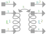

Mutual inductance allows simulation of coupling between inductors. This coupling adds an additional term to the inductor equation:

$$
v_{L_{1}}(t) = L1 \frac{di_{1}(t)}{dt} + M\frac{di_{2}(t)}{dt}
$$

$$
v_{L_{2}}(t) = L2 \frac{di_{2}(t)}{dt} + M\frac{di_{1}(t)}{dt}
$$

with 

$$
M = k\sqrt{L_{1} L_{2}}
$$

We expand these equations to:

$$
\left(V_{L_{1}}\right)_n - \frac{3L_{1}}{2h}\left(I_{L_{1}}\right)_n - \frac{3M}{2h}\left(I_{L_{2}}\right)_n =  - \frac{2L_{1}}{h}\left(I_{L_{1}}\right)_{n-1} + \frac{L_{1}}{2h}\left(I_{L_{1}}\right)_{n-2}  - \frac{2M}{h}\left(I_{L_{2}}\right)_{n-1} + \frac{M}{2h}\left(I_{L_{2}}\right)_{n-2}
$$

$$
\left(V_{L_{2}}\right)_n - \frac{3L_{2}}{2h}\left(I_{L_{2}}\right)_n - \frac{3M}{2h}\left(I_{L_{1}}\right)_n =  - \frac{2L_{2}}{h}\left(I_{L_{2}}\right)_{n-1} + \frac{L_{2}}{2h}\left(I_{L_{2}}\right)_{n-2}  - \frac{2M}{h}\left(I_{L_{1}}\right)_{n-1} + \frac{M}{2h}\left(I_{L_{1}}\right)_{n-2}
$$

This leads to the component stamp matrix:

$$
\begin{bmatrix}
0 & 0 & 0 & 0 & 1 & 0 \\
0 & 0 & 0 & 0 & -1 & 0 \\		
0 & 0 & 0 & 0 & 0 & 1 \\
0 & 0 & 0 & 0 & 0 & -1 \\
1 & -1 & 0 & 0 & - \frac{3L_{1}}{2h} & - \frac{3M}{2h} \\		
0 & 0 & 1 & -1 &  - \frac{3M}{2h} & - \frac{3L_{2}}{2h} \\
\end{bmatrix}
\begin{bmatrix}
V_{L_{1}}^{+} \\
V_{L_{1}}^{-} \\		
V_{L_{2}}^{+} \\		
V_{L_{2}}^{-} \\
I_{L_{1}} \\ 
I_{L_{2}}
\end{bmatrix}
=
\begin{bmatrix}
0 \\
0 \\
0 \\
0 \\ 
- \frac{2L_{1}}{h}\left(I_{L_{1}}\right)_{n-1} + \frac{L_{1}}{2h}\left(I_{L_{1}}\right)_{n-2}  - \frac{2M}{h}\left(I_{L_{2}}\right)_{n-1} + \frac{M}{2h}\left(I_{L_{2}}\right)_{n-2} \\ 
- \frac{2L_{2}}{h}\left(I_{L_{2}}\right)_{n-1} + \frac{L_{2}}{2h}\left(I_{L_{2}}\right)_{n-2}  - \frac{2M}{h}\left(I_{L_{1}}\right)_{n-1} + \frac{M}{2h}\left(I_{L_{1}}\right)_{n-2}
\end{bmatrix}
$$

The phase variant of this

$$
\frac{\Phi_0}{2\pi}\frac{d\phi_{L_{1}}}{dt} = L_{1}\frac{di_{L_{1}}}{dt} + M\frac{di_{L_{2}}}{dt}
$$

$$
\frac{\Phi_0}{2\pi}\frac{d\phi_{L_{2}}}{dt} =M\frac{di_{L_{1}}}{dt} + L_{2}\frac{di_{L_{2}}}{dt}
$$

With integration on both sides

$$
\frac{\Phi_0}{2\pi}\phi_{L_{1}} = L_{1}I_{L_{1}} + MI_{L_{2}}
$$

$$
\frac{\Phi_0}{2\pi}\phi_{L_{2}} = MI_{L_{1}} + L_{2}I_{L_{2}}
$$

This leads to a quite simplified component stamp matrix

$$
\begin{bmatrix}
0 & 0 & 0 & 0 & 1 & 0 \\
0 & 0 & 0 & 0 & -1 & 0 \\		
0 & 0 & 0 & 0 & 0 & 1 \\
0 & 0 & 0 & 0 & 0 & -1 \\
1 & -1 & 0 & 0 & -\frac{2\pi}{\Phi_0}L_{1} & -\frac{2\pi}{\Phi_0}M \\		
0 & 0 & 1 & -1 & -\frac{2\pi}{\Phi_0}M & -\frac{2\pi}{\Phi_0}L_{2} \\
\end{bmatrix}
\begin{bmatrix}
\phi_{L_{1}}^{+} \\
\phi_{L_{1}}^{-} \\		
\phi_{L_{2}}^{+} \\		
\phi_{L_{2}}^{-} \\
I_{L_{1}} \\ 
I_{L_{2}}
\end{bmatrix}
=
\begin{bmatrix}
0 \\
0 \\
0 \\
0 \\
0 \\ 
0
\end{bmatrix}
$$

### Current Controlled Current Source

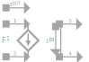

Current controlled current source allows modulation of current in a particular branch through the current in a remote branch.

$$
I_{out} = \beta I_{in}
$$

$$
V_{1} - V_{2} = 0
$$

$$
\beta = value
$$

$$
\begin{bmatrix}
	0 & 0 & 0 & 0 & \frac{1}{\beta} \\
	0 & 0 & 0 & 0 & -\frac{1}{\beta} \\	
	0 & 0 & 0 & 0 & 1 \\
	0 & 0 & 0 & 0 & -1 \\
	1 & -1 & 0 & 0 & 0
	\end{bmatrix}
	\begin{bmatrix}
	V_{1}\\
	V_{2}\\
	V_{3}\\
	V_{4}\\
	I_{out}
	\end{bmatrix}
	=
	\begin{bmatrix}
	0\\
	0\\
	0\\
	0\\
	0
	\end{bmatrix}
$$

### Current Controlled Voltage Source

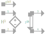

Current controlled voltage source allows the modulation of a voltage node through a remote current.

$$
V_{1} - V_{2} = 0
$$

$$
V_{3} - V_{4} = \mu I_{in}
$$

$$
\begin{bmatrix}
0 & 0 & 0 & 0 & 1 & 0\\
0 & 0 & 0 & 0 & -1 & 0\\
0 & 0 & 0 & 0 & 0 & 1\\
0 & 0 & 0 & 0 & 0 & -1\\
0 & 0 & 1 & -1 & -\mu & 0\\
1 & -1 & 0 & 0 & 0 & -\mu
\end{bmatrix}
\begin{bmatrix}
V_{1}\\
V_{2}\\
V_{3}\\
V_{4}\\
I_{in}\\
I_{out}\end{bmatrix}
=
\begin{bmatrix}
0\\
0\\
0\\
0\\
0\\
0
\end{bmatrix}
$$

### Voltage Controlled Current Source

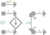

Voltage controlled current source allows the modulation of a current in a branch through a remote voltage.

$$
\alpha(V_{1} - V_{2}) = I_{out}
$$

$$
\begin{bmatrix}
0 & 0 & 0 & 0 & 0\\
0 & 0 & 0 & 0 & 0\\
0 & 0 & 0 & 0 & 1\\
0 & 0 & 0 & 0 & -1\\
1 & -1 & 0 & 0 & -\frac{1}{\alpha}
\end{bmatrix}
\begin{bmatrix}
V_{1}\\
V_{2}\\
V_{3}\\
V_{4}\\
I_{in}
\end{bmatrix}
=
\begin{bmatrix}
0\\
0\\
0\\
0\\
0
\end{bmatrix}
$$

### Voltage Controlled Voltage Source

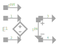

Voltage controlled current source allows the modulation of a current in a branch through a remote voltage.

$$
A(V_{1} - V_{2}) = V_{3}-V_{4}
$$

$$
\begin{bmatrix}
0 & 0 & 0 & 0 & 0\\
0 & 0 & 0 & 0 & 0\\
0 & 0 & 0 & 0 & 1\\
0 & 0 & 0 & 0 & -1\\
G & -G & 1 & -1 & 0
\end{bmatrix}
\begin{bmatrix}
V_{1}\\
V_{2}\\
V_{3}\\
V_{4}\\
I_{out}
\end{bmatrix}
=
\begin{bmatrix}
0\\
0\\
0\\
0\\
0
\end{bmatrix}
$$

[^1]:W. Haberkorn, H. Knauer and J. Richter, "A theoretical study of the current-phase relation in Josephson contacts" in *physica status solidi (a)*, vol. 47, no. 2, pp. K161-K164, 1978 

