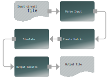

# JoSIM - Superconducting Circuit Simulator

Developers Manual for v2.6.5

## Project Status

### Testing: v2.6.5 - Status: [](https://joeydelp.visualstudio.com/JoSIM/_build/latest?definitionId=1&branchName=testing)

### Stable: v2.6.5 - Status: [](https://joeydelp.visualstudio.com/JoSIM/_build/latest?definitionId=3&branchName=master)

## Introduction

JoSIM was developed under IARPA contract SuperTools(via the U.S. Army Research Office grant W911NF-17-1-0120). JoSIM is a analogue circuit simulator with SPICE syntax input that has inherent support for the superconducting Josephson junction element.

JoSIM is meant to function as an alternative to the simulators such as JSIM[^1] and WRspice[^2]. JoSIM is written in modern C++ and is fully customizable and extendable to offer support for improved superconducting elements as well better approximations to the Josephson effect in superconducting materials.

A *.cir* file containing a SPICE syntax circuit netlist is provided as input. The circuit netlist, given appropriate input excitations can then be simulated through transient analysis. Results of this simulation can be dumped to standard output or saved in various formats such as a comma separated value (*.csv*) file.

Below is a macro overview of the process performed by JoSIM. This is very basic and is discussed in further detail in the [Technical Discussion](tech_disc.md) section of the documentation.

<center></center>


## Project layout

The JoSIM repository has the following layout. A quick description shows the purpose of the various files and folders.

    cmake   			# CMake scripts.
    docs/
        index.md		# The documentation homepage.
        ...      		# Other markdown pages, images and other files.
    include/
        JoSIM			# JoSIM header files.
    scripts				# Some Python3 scripts to automate testing and plotting
    site				# Where this documentation spawns from.
    src/
        ...				# JoSIM source files.
    test				# Folder containing various examples.
    README.md			# Basic readme to get the user going.
    LICENSE				# License that governs use of JoSIM.
    CMakeLists.txt		# Configuration to compile code.
    ...					# Other configuration files and scripts.

## Initial setup
With each major version of JoSIM a release for all major platforms is generated and placed under the [Releases](https://github.com/JoeyDelp/JoSIM/releases) section of the GitHub repository. At the time of writing, this is version 2.5.

To compile JoSIM from source, the following packages are required:

- CMake 3.14
- Git
- C++ compiler with C++17 support

### Building from source
#### Linux

These instructions were executed on a minimal install of CentOS 7 to reduce oversight in the compilation instructions created by previous package installs. For other distributions please use the package manager relevant to the distribution of choice.

A working internet connection is required, as well as the ability to install packages. If the internet connection is not up please run, and replace <network interface> with your relevant interface i.e *eth0*:

```bash
sudo ifup <network interface>
```

CentOS 7 does not contain all the enterprise Linux packages in its default repository and therefore needs to be activated using:

```bash
sudo yum install epel-release
sudo yum update
```

CentOS 7 will require development packages to be installed. Fortunately this can be done using a single command:

```bash
sudo yum groupinstall "Development Tools"
```

This will install various development tools such as *gcc*, *make* and *git*. JoSIM, however, requires a newer version of *gcc* than the one supplied within these packages. Fortunately this can be installed fairly easily by running the following:

```bash
sudo yum install centos-release-scl
sudo yum install devtoolset-8
scl enable devtoolset-8 bash
```

The last command needs to be entered whenever the newer *gcc* is needed. This can fortunately be shortened using an alias:

```bash
echo 'alias dts8="scl enable devtoolset-8 bash"' >> ~/.bashrc
```

This will enable the devtoolset-8 environment on the current bash by just entering the command *dts8*.

To simplify installation of various packages we make use of Python 3 and pip:

```bash
sudo install python36 python36-pip
```

This allows installation of the most relevant package version of *cmake*:

```bash
pip3 install cmake --user
```

We are now ready to compile JoSIM

JoSIM source can be directly downloaded from the repository as a compressed *.tar.gz* file or by cloning the repository. In either case, navigate to a directory where compilation will take place and extract the tarball or execute:

```bash
git clone https://github.com/JoeyDelp/JoSIM.git
cd JoSIM
```

Navigate to the newly cloned/extracted JoSIM directory then run the following commands:

```bash
mkdir build
cd build
cmake ..
cmake --build . --config Release
```

This will generate a JoSIM executable in the **build** directory.

Additionally, the *libjosim* library will also be generated. To use the library (and josim-cli) it needs to be PATH obtainable. The best way to do this is to do: 

```bash
sudo make install
```

This option will install *josim-cli* and *libjosim*, as well as the header files needed to use it, in the relevant installation directories detected by the CMake *GNUInstallDirs* macro.

#### Apple macOS

Apple macOS is very similar to most Unix systems and therefore follows mostly the same procedure. The user would clone the repository and install CMake and Git. These requirements can be installed using either Homebrew, Macports or compiled from source using the standard macOS compilers (installed through Xcode).

Python 3 is available through Homebrew and CMake can almost always be installed using pip (PyPI). 

#### Microsoft Windows

There are various ways to compile JoSIM on the Microsoft Windows platform. The simplest way to do this is to install the [Community version of Microsoft Visual Studio](https://visualstudio.microsoft.com/thank-you-downloading-visual-studio/?sku=Community&rel=16), which is free to use. This is only to acquire a working C++ compiler that can be used by CMake.

Next Python 3 will also be needed. This can be installed using Windows Store, Anaconda or [Miniconda](https://docs.conda.io/en/latest/miniconda.html). Once installed CMake can be installed much the same as any other system:

```powershell
pip install cmake --user
```

To ensure that CMake detects the correct compiler (a restart might be required after MSVC install) simply run:

```powershell
cmake --help
```

This should produce a help menu with a generator list at the bottom. If MSVC is installed and detected then it should have an asterisk (*) next to the relevant MSVC version to indicate that it is the default generator.

The rest of the guide follows the same steps as Linux:

```powershell
mkdir build
cd build
cmake ..
cmake --build . --config Release
```

This will produce the JoSIM executable (*josim-cli*) and library (*josim.lib*) in the **build/Release** folder.

Unlike Unix systems, Windows does not complete the *CMake* *GNUInstallDirs* macro correctly and if used would potentially install *josim-cli* in a strange location such as **C:\usr\local\josim\bin\josim-cli**. It is therefore not recommended to use the install command on Windows systems but to rather copy or move the executable *josim-cli* to a location that is PATH obtainable under Windows.

One way to do this is to create a folder under **C:\\**  called **JoSIM**, placing the *josim-cli* and *josim.lib* files from the **build/Release** directory inside and adding it to PATH environment by opening an elevated command prompt through **Win+x** key combination and choosing **Command Prompt (Admin)**. Type in the following command and hit enter:

```bash
SETX PATH %PATH%;C:\JoSIM
```

This will add the **C:\JoSIM**  folder to the PATH and allow *josim-cli* to be located through non-elevated command prompt. 

#### TimeEx and other tools

Some tools, such as TimEx, require *josim-cli* to be named *josim*. Since the josim command line executable (*josim-cli*) is a singular executable, this means that there are no files that rely on its specific naming for JoSIM to function correctly. It can thus safely be renamed or copies made thereof with varying names as required by external tools (such as TimEx).

Under Unix systems a symbolic link can be established through:

```bash
sudo ln -s /usr/local/bin/josim-cli /usr/local/bin/josim
```

Where the first path is the source and the second is the destination. If *josim-cli* is updated *josim* will reflect this since the symbolic link simply makes *josim-cli* obtainable through another name.

On Windows it is best to simply rename *josim-cli* or to make a copy thereof with a new name.

### License

JoSIM is governed by the MIT license, which is a very permissive license that allows anyone to redistribute the source as well as commercialize it without repercussions. The MIT license allows use of this software within proprietary software as long as all copies of the licensed software includes a copy of the MIT license as well as the copyright notice.

[^1]: E. S. Fang and T. Van Duzer, "A Josephson integrated circuit simulator (JSIM) for superconductive electronics application," in *Extended Abstracts of 1989 Intl. Superconductivity Electronics Conf. (ISEC '89)*, Tokyo, Japan: JSAP, pp. 407-410, 1989
[^2]: S. R. Whiteley, "WRspice Circuit Simulator" by *Whiteley Research Incorporated*. http://www.wrcad.com/wrspice.html