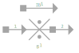
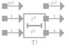
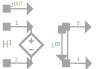
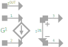

# 素子のスタンプ

このセクションではJoSIMの中で使える素子のスタンプについて見ていきます。2段の後退微分法（BDF2）がどのように各素子の時間依存の電圧やphaseの式に適用されているのか見ていくのに役立ちます。

[技術的な議論](tech_disc_jp.md)のセクションで見たキャパシタの話については続きの内容になっています。

### 抵抗

抵抗はオームの法則で電位依存式が定められた受動素子です：

$$
v(t) = i_{R_{1}}(t) R_{1}
$$

$$
V_{n}-R_{1}I_{R_{1}} = 0
$$

行列のスタンプとしてはこのように書けます：

$$
\begin{bmatrix}
0 & 0 & 1 \\
0 & 0 & -1 \\
1 & -1 & -R_{1}
\end{bmatrix}
\begin{bmatrix}
V^{+} \\
V^{-}\\
I_{R_{1}}
\end{bmatrix}
=
\begin{bmatrix}
0\\
0\\
0 
\end{bmatrix}
$$

[技術的な議論](tech_disc_jp.md)のセクションで示した電圧-位相関係を用いてこれを展開すると、数式はこのように書き直すことが出来ます：

$$
\frac{\Phi_{0}}{2\pi}\frac{d\phi}{dt}_{n}\frac{1}{R_{1}} = I_{R_{1}}
$$

ここでBDF2法の適用が必要となります：

$$
\frac{\Phi_{0}}{2\pi R_{1}}\frac{3}{2h}\left[\phi_n - \frac{4}{3}\phi_{n-1} + \frac{1}{3}\phi_{n−2}\right] = {I_{R_{1}}}
$$

$$
\phi_n - \frac{2\pi R_{1}}{\Phi_0}\frac{2h}{3}I_{R_{1}} =\frac{4}{3}\phi_{n-1} - \frac{1}{3}\phi_{n−2}
$$

これにより位相と抵抗の行列のスタンプを作ることができます：

$$
\begin{bmatrix}
0 & 0 & 1 \\
0 & 0 & -1 \\ 
1 & -1 &  - \frac{2\pi R_{1}}{\Phi_0}\frac{2h}{3}
\end{bmatrix}
\begin{bmatrix}
\phi_{1} \\
\phi_{2} \\ I_{R_{1}}
\end{bmatrix}
=
\begin{bmatrix}
0\\
0 \\  
\frac{4}{3}\phi_{n-1} - \frac{1}{3}\phi_{n−2}
\end{bmatrix}
$$

### インダクタ

電圧と電流の点からインダクタはこのように定義されます：

$$
v(t)=L_{1}\frac{di}{dt}
$$

これは一次微分でありBDF2法による展開が必要です：

$$
V_{n} = \frac{3L_{1}}{2h}\left[I_{n}-\frac{4}{3}I_{n-1}+\frac{1}{3}I_{n-2}\right]
$$

$$
V_{n}-\frac{3L_{1}}{2h}I_{n}=-\frac{2L_{1}}{h}I_{n-1}+\frac{L_{1}}{2h}I_{n-2}
$$

これにより次のようなインダクタのスタンプを作ることが出来ます：

$$
\begin{bmatrix}
0 & 0 & 1 \\
0 & 0 & -1 \\
1 & -1 &  -\frac{3L_{1}}{2h}
\end{bmatrix}
\begin{bmatrix}
V^{+} \\
V^{-} \\
I_{L_{1}}
\end{bmatrix}
=
\begin{bmatrix}
0 \\
0 \\
-\frac{2L_{1}}{h}I_{n-1}+\frac{L_{1}}{2h}I_{n-2}
\end{bmatrix}
$$

電圧-位相関係を代入することによりインダクタのMNPAスタンプを得ることが出来ます。

$$
\frac{\Phi_{0}}{2\pi}\frac{d\phi}{dt}=L_{1}\frac{di}{dt}
$$

両辺の導関数を用いて、時間に関して両辺を積分します：

$$
\int\frac{\Phi_{0}}{2\pi}\frac{d\phi}{dt}=\int L_{1}\frac{di}{dt}
$$

$$
\frac{\Phi_{0}}{2\pi}\phi_{n}=L_{1}I_{n}
$$

$$
\phi_{n} - \frac{2\pi}{\Phi_{0}}L_{1}I_{n} = 0
$$

極めて単純なMNPAスタンプ行列が導かれます：

$$
\begin{bmatrix}
0 & 0 & 1 \\
0 & 0 & -1 \\ 
1 & -1 &  - \frac{2\pi}{\Phi_{0}}L_{1}
\end{bmatrix}
\begin{bmatrix}
\phi^{+} \\
\phi^{-} \\ 
I_{L_{1}}
\end{bmatrix}
=
\begin{bmatrix}
0\\
0 \\ 
0
\end{bmatrix}
$$

### Josephson Junction

上のJJはJoSIMで実装されている抵抗・容量成分でシャントされた簡略化されたモデル(RCSJモデル)です。このモデルでは3つの並列に流れる電流の和を取っており次の式で表されます：

$$
I_{B_{1}} = I_c \sin{\phi} + \frac{V_{n}}{R_{B_{1}}} + C_{B_{1}}\frac{dV_{n}}{dt}
$$

BDF2法により展開されると次のようになります：

$$
I_{B_{1}} = I_{c}\sin\phi+\frac{V_{n}}{R_{B_{1}}}+\frac{3C_{B_{1}}}{2h}\left[V_{n}-\frac{4}{3}V_{n-1}+\frac{1}{3}V_{n-2}\right]
$$

$$
\frac{V_{n}}{R_{B_{1}}}+ \frac{3C_{B_{1}}}{2h}V_{n} - I_{B_{1}} = -I_{c}\sin\phi+\frac{3C_{B_{1}}}{2h}\frac{4}{3}V_{n-1}-\frac{3C_{B_{1}}}{2h}\frac{1}{3}V_{n-2}
$$

$$
V_{n}-\frac{2hR_{B_{1}}}{2h+3C_{B_{1}}R_{B_{1}}}I_{B_{1}}=\frac{2hR_{B_{1}}}{2h+3C_{B_{1}}R_{B_{1}}}\left[I_{c}\sin\phi-\frac{2C_{B_{1}}}{h}V_{n-1}+\frac{C_{B_{1}}}{2h}V_{n-2}\right]
$$

この式は前のタイムステップのphaseを必要としているため、値は計算されている必要があります。しかし、phaseに関しては解かれていないため、電圧-位相関係からphaseの電圧依存式を見る必要があります：

$$
V_{n} = \frac{\Phi_0}{2\pi}{\frac{d\phi}{dt}}_{n}
$$

$$
V_{n} = \frac{\Phi_{0}}{2\pi}\frac{3}{2h}\left[\phi_{n}-\frac{4}{3}\phi_{n-1}+\frac{1}{3}\phi_{n-2}\right]
$$

$$
V_{n}-\frac{\Phi_{0}}{2\pi}\frac{3}{2h}\phi_n=-\frac{\Phi_{0}}{2\pi}\frac{2}{h}\phi_{n-1}+\frac{\Phi_{0}}{2\pi}\frac{1}{h}\phi_{n-2}
$$

スタンプ行列を作るためこの2つの式を組み合わせます：

$$
\begin{bmatrix}
0 & 0 & 0 & 1 \\
0 & 0 & 0 & -1 \\
1 & -1 & -\frac{\Phi_{0}}{2\pi}\frac{3}{2h} & 0 \\ 
1 & -1 & 0 & -\frac{2hR_{B_{1}}}{2h+3C_{B_{1}}R_{B_{1}}}
\end{bmatrix}
\begin{bmatrix}
V^{+} \\
V^{-} \\ 
\phi_{n}\\
I_{B_{1}}
\end{bmatrix}
=
\begin{bmatrix}
0 \\
0 \\
-\frac{\Phi_{0}}{2\pi}\frac{2}{h}\phi_{n-1}+\frac{\Phi_{0}}{2\pi}\frac{1}{h}\phi_{n-2} \\
I_{s} 
\end{bmatrix}
$$

Where $I_{s} = \frac{2hR_{B_{1}}}{2h+3C_{B_{1}}R_{B_{1}}}\left[I_{c}\sin\phi-\frac{2C_{B_{1}}}{h}V_{n-1}+\frac{C_{B_{1}}}{2h}V_{n-2}\right]$

しかし、現在のタイムステップのphaseを現在のタイムステップの計算に使えるわけではないので、前のタイムステップの値を元にした推定値に頼るしかありません。

推定方法は以下のように定義されています：

$$
\phi_{n}^{0} =\frac{4}{3}\phi_{n-1}-\frac{1}{3}\phi_{n-2}+ \frac{2\pi}{\Phi_{0}}\frac{2h}{3}V_{n}^{0}
$$

$$
V_{n}^{0} = V_{n-1} + h\frac{dV}{dt}_{n-1}
$$

$$
V_{n}^{0}=V_{n-1}+\frac{3}{2}V_{n-1}-2V_{n-2}+\frac{1}{2}V_{n-3}
$$

$$
V_{n}^{0}=\frac{5}{2}V_{n-1}-2V_{n-2}+\frac{1}{2}V_{n-3}
$$

現在のphaseはやや基本的すぎる例となっているのでHaberkorn[^1]によって定義されたより一般的な超伝導電流項があるものに置き換えています：
The current phase case is rather basic and we therefore replace the supercurrent term with the more general term defined by Haberkorn[^1]:

$$
I_c\sin\phi = \frac{\pi\Delta}{2eR_N}\frac{\sin{\phi}}{\sqrt{1 - \overline{D}\sin^2\left(\frac{\phi}{2}\right)}}\tanh\left[\frac{\Delta}{2k_BT}\sqrt{1-\overline{D}\sin^2\left(\frac{\phi}{2}\right)}\right]
$$

この式ではjunctionモデルに$\Delta$より温度依存性が導入されています：

$$
\Delta_0 = 1.76k_BT_c​
$$

$$
\Delta = \Delta_0\sqrt{\cos\left[\frac{\pi}{2}\left(\frac{T}{T_c}\right)^2\right]}
$$

$T$はヘリウムの沸点（4.2K）であり、$T_{c}$ はニオブの臨界温度 (9.1K) 、$k_{B}$は粒子の平均運動エネルギーによるボルツマン定数です。

抵抗値$R_{N}$は以下のように定義されます：

$$
R_N = \frac{\pi\Delta}{2eI_c}\tanh\left(\frac{\Delta}{2k_{B}T}\right)
$$

これによって\(\overline{D}\)の透過度をただ変更するだけでトンネル電流の特性を変えることができます。$\overline{D} \ll 1$の場合は通常の正弦波の式になる一方、$\overline{D}$が大きい場合は非正弦波形の弾道的トンネリングの式になります。

Josephson接合を定義するにはこれまでに明らかにした電圧と位相の部分をただ入れ替えればよいです。Josephson接合は既にphase素子となっているため式はほぼ同じままです。

$$
\begin{bmatrix}
0 & 0 & 0 & 1 \\
0 & 0 & 0 & -1 \\
1 & -1 & -\frac{2\pi}{\Phi_{0}}\frac{2h}{3} & 0 \\ 
0 & 0 & 1 & -\frac{2hR_{B_{1}}}{2h+3C_{B_{1}}R_{B_{1}}}	
\end{bmatrix}
\begin{bmatrix}
\phi^{+} \\
\phi^{-} \\ 
V_{n}\\
I_{B_{1}}
\end{bmatrix}
=
\begin{bmatrix}
0 \\
0 \\
\frac{4}{3}\phi_{n-1} - \frac{1}{3}\phi_{n-2} \\
I_{s} 
\end{bmatrix}
$$

### 電圧源

電圧源に関しては既に知られていること以外何もありません。電圧のソースであり、つまり全てのタイムステップにおいての電圧が分かっています。したがって次のような式で簡単に素子のスタンプ行列を作ることが出来ます：

$$
\begin{bmatrix}
0 & 0 & 1 \\
0 & 0 & -1 \\ 
1 & -1 & 0	
\end{bmatrix}
\begin{bmatrix}
V^{+} \\
V^{-} \\ 
I_{V_{1}}
\end{bmatrix}
=
\begin{bmatrix}
0\\
0 \\ 
V_{1}
\end{bmatrix}
$$

この素子の位相は単純に電圧-位相関係から電圧を置き換えて見ています：

$$
\begin{bmatrix}
0 & 0 & 1 \\
0 & 0 & -1 \\ 
1 & -1 & 0	
\end{bmatrix}
\begin{bmatrix}
\phi_{+} \\
\phi_{-} \\ 
I_{V_{1}}
\end{bmatrix}
=
\begin{bmatrix}
0\\
0 \\ 
\frac{4}{3}\phi_{n-1}-\frac{1}{3}\phi_{n-2}+ \frac{2\pi}{\Phi_{0}}\frac{2h}{3}V_{n}
\end{bmatrix}
$$

### 電流源

電流源は文字通り、シミュレーション中の全てのタイムステップで電流量が知られているものです。したがってRHSで必要な場合簡単に利用可能です。

$$
\begin{bmatrix}
0 & 0  \\
0 & 0 	
\end{bmatrix}
\begin{bmatrix}
V^{+} \\
V^{-}
\end{bmatrix}
=
\begin{bmatrix}
-I_{1}\\
I_{1}
\end{bmatrix}
$$

### 位相ソース

電圧源のように、回路中で必要な位相を単純に印加します。

$$
\begin{bmatrix}
0 & 0 & 1 \\
0 & 0 & -1 \\ 
1 & -1 & 0	
\end{bmatrix}
\begin{bmatrix}
\phi^{+} \\
\phi^{-} \\ 
I_{\phi}
\end{bmatrix}
=
\begin{bmatrix}
0\\
0 \\ 
\phi_{n}
\end{bmatrix}
$$

解析で電圧モードが使用されている場合、この素子は次のスタンプにより電圧源に変換されます：

$$
\begin{bmatrix}
0 & 0 & 1 \\
0 & 0 & -1 \\ 
1 & -1 & 0	
\end{bmatrix}
\begin{bmatrix}
V^{+} \\
V^{-} \\ 
I_{\phi}
\end{bmatrix}
=
\begin{bmatrix}
0\\
0 \\ 
\frac{\Phi_{0}}{2\pi}\frac{3}{2h}\left[\phi_{n}-\frac{4}{3}\phi_{n-1}+\frac{1}{3}\phi_{n-2}\right]
\end{bmatrix}
$$

### Transmission Line

Transmission lineは現在のところ、遅延($T_{D}$)とインピーダンス($Z_{0}$)によって長さを定義している単純な遅延素子になっています。

現在のところtransmission lineのモデルは何の損失もない理想的な素子となっています。将来的にはより実際に近いtransmission lineのモデルを実装する予定です。

損失なしのtransmission lineの式は以下の通りです：

$$
V_1(t) = Z_{0}I_{T_{1}} + Z_{0}I_{T_{2}}(t − T_{D}) + V_2(t − T_{D})
$$

$$
V_2(t) = Z_{0}I_{T_{2}} + Z_{0}I_{T_{1}}(t − T_{D}) + V_1(t − T_{D})
$$

ここから次の式が導かれます：

$$
(V_{1})_{n} - Z_{0}(I_{T_{1}})_{n} = Z_{0}(I_{T_{2}})_{n-k} + (V_{2})_{n-k}
$$

$$
(V_{2})_{n} - Z_{0}(I_{T_{2}})_{n} = Z_{0}(I_{T_{1}})_{n-k} + (V_{1})_{n-k}
$$

ただし

$$
k=\frac{T_D}{h}
$$

ここから素子のスタンプ行列を作ることが出来ます。

$$
\begin{bmatrix}
0 & 0 & 0 & 0 & 1 & 0 \\
0 & 0 & 0 & 0 & -1 & 0 \\
0 & 0 & 0 & 0 & 0 & 1 \\
0 & 0 & 0 & 0 & 0 & -1 \\
1 & -1 & 0 & 0 & -Z_{0} & 0 \\
0 & 0 & 1 & -1 & 0 & -Z_{0}
\end{bmatrix}
\begin{bmatrix}
V_{1}^{+} \\
V_{1}^{-} \\
V_{2}^{+} \\
V_{2}^{-} \\
I_{T_{1}} \\
I_{T_{2}} \\
\end{bmatrix}
=
\begin{bmatrix}
0 \\
0 \\
0 \\
0 \\
Z_{0}(I_{T_{2}})_{n-k} + (V_{2})_{n-k} \\
Z_{0}(I_{T_{1}})_{n-k} + (V_{1})_{n-k}
\end{bmatrix}
$$

簡単のため、最初のtransmission lineの式だけphaseに展開します：

$$
\frac{\Phi_{0}}{2\pi}\frac{d\phi_{1}}{dt} = Z_{0}(I_{T_{1}})_{n} + Z_{0}(I_{T_{2}})_{n-k} + \frac{\Phi_{0}}{2\pi}\frac{d\phi_2}{dt}_{n-k}
$$

$$
\frac{\Phi_{0}}{2\pi}\left[\frac{3}{2h}(\phi_{1})_{n} - \frac{2}{h}(\phi_{1})_{n-1} + \frac{1}{2h}{\phi_{1}}_{n-2}\right] = Z_{0}(I_{T_{1}})_{n} + Z_{0}(I_{T_{2}})_{n-k} + \frac{\Phi_{0}}{2\pi}\left[\frac{3}{2h}(\phi_{2})_{n-k} - \frac{2}{h}(\phi_{2})_{n-k-1} + \frac{1}{2h}(\phi_{2})_{n-k-2}\right]
$$

$$
\frac{3}{2h}(\phi_{1})_{n} - \frac{2}{h}(\phi_{1})_{n-1} + \frac{1}{2h}(\phi_{1})_{n-2} = \frac{2\pi}{\Phi_{0}}Z_{0}(I_{T_{1}})_{n} + \frac{2\pi}{\Phi_{0}}Z_{0}(I_{T_{2}})_{n-k} + \frac{3}{2h}(\phi_{2})_{n-k} - \frac{2}{h}(\phi_{2})_{n-k-1} + \frac{1}{2h}(\phi_{2})_{n-k-2}
$$

$$
(\phi_{1})_{n} - \frac{2h}{3}\frac{2}{h}(\phi_{1})_{n-1} + \frac{2h}{3}\frac{1}{2h}(\phi_{1})_{n-2} = \frac{2h}{3}\frac{2\pi}{\Phi_{0}}Z_{0}(I_{T_{1}})_{n} + \frac{2h}{3}\frac{2\pi}{\Phi_{0}}Z_{0}(I_{T_{2}})_{n-k} + \frac{2h}{3}\frac{3}{2h}(\phi_{2})_{n-k} - \frac{2h}{3}\frac{2}{h}(\phi_{2})_{n-k-1} + \frac{2h}{3}\frac{1}{2h}(\phi_{2})_{n-k-2}
$$

$$
(\phi_{1})_{n} - \frac{4}{3}(\phi_{1})_{n-1} + \frac{1}{3}(\phi_{1})_{n-2} = \frac{2\pi}{\Phi_{0}}\frac{2h}{3}Z_{0}(I_{T_{1}})_{n} + \frac{2\pi}{\Phi_{0}}\frac{2h}{3}Z_{0}(I_{T_{2}})_{n-k} + (\phi_{2})_{n-k} - \frac{4}{3}(\phi_{2})_{n-k-1} + \frac{1}{3}(\phi_{2})_{n-k-2} \\
$$

式を整理した結果がこのようになります：

$$
(\phi_{1})_n - Z_{0}\frac{2\pi}{\Phi_{0}}\frac{2h}{3}(I_{T_{1}})_{n} = Z_{0}\frac{2\pi}{\Phi_{0}}\frac{2h}{3}{I_{T_{2}}}_{n-k} + \frac{4}{3}(\phi_{1})_{n-1} - \frac{1}{3}(\phi_{1})_{n-2} + (\phi_{2})_{n-k} - \frac{4}{3}(\phi_{2})_{n-k-1} + \frac{1}{3}(\phi_{2})_{n-k-2}
$$

$$
(\phi_{2})_n - Z_{0}\frac{2\pi}{\Phi_{0}}\frac{2h}{3}(I_{T_{2}})_{n} = Z_{0}\frac{2\pi}{\Phi_{0}}\frac{2h}{3}{I_{T_{1}}}_{n-k} + \frac{4}{3}(\phi_{2})_{n-1} - \frac{1}{3}(\phi_{2})_{n-2} + (\phi_{1})_{n-k} - \frac{4}{3}(\phi_{1})_{n-k-1} + \frac{1}{3}(\phi_{1})_{n-k-2}
$$

ここから素子のスタンプ行列を導くことが出来ます：

$$
\begin{bmatrix}
		0 & 0 & 0 & 0 & 1 & 0 \\
		0 & 0 & 0 & 0 & -1 & 0 \\ 
		0 & 0 & 0 & 0 & 0 & 1 \\ 
		0 & 0 & 0 & 0 & 0 & -1 \\ 
		1 & -1 & 0 & 0 & - Z_{0}\frac{2\pi}{\Phi_{0}}\frac{2h}{3} & 0 
		\\ 0 & 0 & 1 & -1 & 0 & - Z_{0}\frac{2\pi}{\Phi_{0}}\frac{2h}{3} 	
		\end{bmatrix}
	\begin{bmatrix}
		\phi_{1}^{+} \\
		\phi_{1}^{-} \\
		\phi_{2}^{+} \\ 
		\phi_{2}^{-} \\ 
		I_{T_{1}} \\ 
		I_{T_{2}}	
		\end{bmatrix}
	=
	\begin{bmatrix}
		0\\
		0 \\ 
		0 \\ 
		0 \\ 
		V_{T_{1}} \\ 
		V_{T_{2}}
	\end{bmatrix}
$$

ここで$V_{T_{1}}$と$V_{T_{2}}$ は上で展開された式のRHSです。

### 相互インダクタンス

相互インダクタンスによって複数のインダクタ間のカップリングをシミュレーションすることが出来ます。このカップリングではインダクタの式に追加の項を加えます：

$$
v_{L_{1}}(t) = L1 \frac{di_{1}(t)}{dt} + M\frac{di_{2}(t)}{dt}
$$

$$
v_{L_{2}}(t) = L2 \frac{di_{2}(t)}{dt} + M\frac{di_{1}(t)}{dt}
$$

ここで

$$
M = k\sqrt{L_{1} L_{2}}
$$

次のように展開します：

$$
\left(V_{L_{1}}\right)_n - \frac{3L_{1}}{2h}\left(I_{L_{1}}\right)_n - \frac{3M}{2h}\left(I_{L_{2}}\right)_n =  - \frac{2L_{1}}{h}\left(I_{L_{1}}\right)_{n-1} + \frac{L_{1}}{2h}\left(I_{L_{1}}\right)_{n-2}  - \frac{2M}{h}\left(I_{L_{2}}\right)_{n-1} + \frac{M}{2h}\left(I_{L_{2}}\right)_{n-2}
$$

$$
\left(V_{L_{2}}\right)_n - \frac{3L_{2}}{2h}\left(I_{L_{2}}\right)_n - \frac{3M}{2h}\left(I_{L_{1}}\right)_n =  - \frac{2L_{2}}{h}\left(I_{L_{2}}\right)_{n-1} + \frac{L_{2}}{2h}\left(I_{L_{2}}\right)_{n-2}  - \frac{2M}{h}\left(I_{L_{1}}\right)_{n-1} + \frac{M}{2h}\left(I_{L_{1}}\right)_{n-2}
$$

これにより素子のスタンプ行列を導くことが出来ます：

$$
\begin{bmatrix}
0 & 0 & 0 & 0 & 1 & 0 \\
0 & 0 & 0 & 0 & -1 & 0 \\		
0 & 0 & 0 & 0 & 0 & 1 \\
0 & 0 & 0 & 0 & 0 & -1 \\
1 & -1 & 0 & 0 & - \frac{3L_{1}}{2h} & - \frac{3M}{2h} \\		
0 & 0 & 1 & -1 &  - \frac{3M}{2h} & - \frac{3L_{2}}{2h} \\
\end{bmatrix}
\begin{bmatrix}
V_{L_{1}}^{+} \\
V_{L_{1}}^{-} \\		
V_{L_{2}}^{+} \\		
V_{L_{2}}^{-} \\
I_{L_{1}} \\ 
I_{L_{2}}
\end{bmatrix}
=
\begin{bmatrix}
0 \\
0 \\
0 \\
0 \\ 
- \frac{2L_{1}}{h}\left(I_{L_{1}}\right)_{n-1} + \frac{L_{1}}{2h}\left(I_{L_{1}}\right)_{n-2}  - \frac{2M}{h}\left(I_{L_{2}}\right)_{n-1} + \frac{M}{2h}\left(I_{L_{2}}\right)_{n-2} \\ 
- \frac{2L_{2}}{h}\left(I_{L_{2}}\right)_{n-1} + \frac{L_{2}}{2h}\left(I_{L_{2}}\right)_{n-2}  - \frac{2M}{h}\left(I_{L_{1}}\right)_{n-1} + \frac{M}{2h}\left(I_{L_{1}}\right)_{n-2}
\end{bmatrix}
$$

phaseにより変形するとこのようになります：

$$
\frac{\Phi_0}{2\pi}\frac{d\phi_{L_{1}}}{dt} = L_{1}\frac{di_{L_{1}}}{dt} + M\frac{di_{L_{2}}}{dt}
$$

$$
\frac{\Phi_0}{2\pi}\frac{d\phi_{L_{2}}}{dt} =M\frac{di_{L_{1}}}{dt} + L_{2}\frac{di_{L_{2}}}{dt}
$$

両辺を積分すると

$$
\frac{\Phi_0}{2\pi}\phi_{L_{1}} = L_{1}I_{L_{1}} + MI_{L_{2}}
$$

$$
\frac{\Phi_0}{2\pi}\phi_{L_{2}} = MI_{L_{1}} + L_{2}I_{L_{2}}
$$

これによりかなり単純な素子のスタンプ行列が導かれます：
This leads to a quite simplified component stamp matrix

$$
\begin{bmatrix}
0 & 0 & 0 & 0 & 1 & 0 \\
0 & 0 & 0 & 0 & -1 & 0 \\		
0 & 0 & 0 & 0 & 0 & 1 \\
0 & 0 & 0 & 0 & 0 & -1 \\
1 & -1 & 0 & 0 & -\frac{2\pi}{\Phi_0}L_{1} & -\frac{2\pi}{\Phi_0}M \\		
0 & 0 & 1 & -1 & -\frac{2\pi}{\Phi_0}M & -\frac{2\pi}{\Phi_0}L_{2} \\
\end{bmatrix}
\begin{bmatrix}
\phi_{L_{1}}^{+} \\
\phi_{L_{1}}^{-} \\		
\phi_{L_{2}}^{+} \\		
\phi_{L_{2}}^{-} \\
I_{L_{1}} \\ 
I_{L_{2}}
\end{bmatrix}
=
\begin{bmatrix}
0 \\
0 \\
0 \\
0 \\
0 \\ 
0
\end{bmatrix}
$$

### 電流制御電流源

電流制御電流源とは、離れたブランチの電流によって特定のブランチの電流を変調できるような電流源です。

$$
I_{out} = \beta I_{in}
$$

$$
V_{1} - V_{2} = 0
$$

$$
\beta = value
$$

$$
\begin{bmatrix}
	0 & 0 & 0 & 0 & \frac{1}{\beta} \\
	0 & 0 & 0 & 0 & -\frac{1}{\beta} \\	
	0 & 0 & 0 & 0 & 1 \\
	0 & 0 & 0 & 0 & -1 \\
	1 & -1 & 0 & 0 & 0
	\end{bmatrix}
	\begin{bmatrix}
	V_{1}\\
	V_{2}\\
	V_{3}\\
	V_{4}\\
	I_{out}
	\end{bmatrix}
	=
	\begin{bmatrix}
	0\\
	0\\
	0\\
	0\\
	0
	\end{bmatrix}
$$

### 電流制御電圧源

電流制御電圧源とは、離れた電流によって電圧ノードを変調させることが出来るような電圧源です。

$$
V_{1} - V_{2} = 0
$$

$$
V_{3} - V_{4} = \mu I_{in}
$$

$$
\begin{bmatrix}
0 & 0 & 0 & 0 & 1 & 0\\
0 & 0 & 0 & 0 & -1 & 0\\
0 & 0 & 0 & 0 & 0 & 1\\
0 & 0 & 0 & 0 & 0 & -1\\
0 & 0 & 1 & -1 & -\mu & 0\\
1 & -1 & 0 & 0 & 0 & -\mu
\end{bmatrix}
\begin{bmatrix}
V_{1}\\
V_{2}\\
V_{3}\\
V_{4}\\
I_{in}\\
I_{out}\end{bmatrix}
=
\begin{bmatrix}
0\\
0\\
0\\
0\\
0\\
0
\end{bmatrix}
$$

### 電圧制御電流源

電圧制御電流源とは、離れた電圧によってブランチの電流を変調させることが出来るような電流源です。

$$
\alpha(V_{1} - V_{2}) = I_{out}
$$

$$
\begin{bmatrix}
0 & 0 & 0 & 0 & 0\\
0 & 0 & 0 & 0 & 0\\
0 & 0 & 0 & 0 & 1\\
0 & 0 & 0 & 0 & -1\\
1 & -1 & 0 & 0 & -\frac{1}{\alpha}
\end{bmatrix}
\begin{bmatrix}
V_{1}\\
V_{2}\\
V_{3}\\
V_{4}\\
I_{in}
\end{bmatrix}
=
\begin{bmatrix}
0\\
0\\
0\\
0\\
0
\end{bmatrix}
$$

### 電圧制御電圧源

電圧制御電圧源とは、離れた電圧によって電圧ノードを変調させることが出来るような電圧源です。

$$
A(V_{1} - V_{2}) = V_{3}-V_{4}
$$

$$
\begin{bmatrix}
0 & 0 & 0 & 0 & 0\\
0 & 0 & 0 & 0 & 0\\
0 & 0 & 0 & 0 & 1\\
0 & 0 & 0 & 0 & -1\\
G & -G & 1 & -1 & 0
\end{bmatrix}
\begin{bmatrix}
V_{1}\\
V_{2}\\
V_{3}\\
V_{4}\\
I_{out}
\end{bmatrix}
=
\begin{bmatrix}
0\\
0\\
0\\
0\\
0
\end{bmatrix}
$$

[^1]:W. Haberkorn, H. Knauer and J. Richter, "A theoretical study of the current-phase relation in Josephson contacts" in *physica status solidi (a)*, vol. 47, no. 2, pp. K161-K164, 1978 

