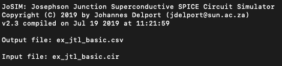
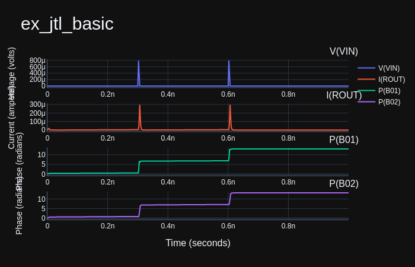

# 使用例

## JTLの基本例

このセクションではJoSIMの使い方の例を示します。[*test*](https://github.com/JoeyDelp/JoSIM/tree/master/test)フォルダの中にJoSIMを使ってテストできるサンプルファイルが複数入っています。

この例では[ *ex_jtl_basic.cir*](https://github.com/JoeyDelp/JoSIM/tree/master/test/ex_jtl_basic.cir)のファイルを利用します。これは基本的なJosephson transmission line (JTL)でのsingle flux quantumパルスの入力から出力への伝搬を表しています。

~~~
* Example JTL Basic
B01        3          7          jmod     area=2.16
B02        6          8          jmod     area=2.16
IB01       0          1          pwl(0      0 5p 280u)
L01        4          3          2p        
L02        3          2          2.425p    
L03        2          6          2.425p    
L04        6          5          2.031p    
LP01       0          7          0.086p    
LP02       0          8          0.096p    
LPR01      2          1          0.278p    
LRB01      7          9          0.086p    
LRB02      8          10         0.086p    
RB01       9          3          5.23      
RB02       10         6          5.23      
ROUT       5          0          2         
VIN        4          0          pwl(0 0 300p 0 302.5p 827.13u 305p 0 600p 0 602.5p 827.13u 605p 0)
.model jmod jj(rtype=1, vg=2.8mV, cap=0.07pF, r0=160, rN=16, icrit=0.1mA)
.tran 0.25p 1000p 0 0.25p
.print DEVV VIN
.print DEVI ROUT
.print PHASE B01
.print PHASE B02
.end
~~~


電圧源(VIN)の電圧(DEVV) 、出力抵抗(ROUT) の電流(DEVI)、両方のJJの位相が出力されるよう要求しています。

シミュレーションは0.25psごとに1000ps実行されるので、要求されたパラメータをそれぞれ4000点出力します。

（CentOS 7の場合）シミュレーションは以下のコマンドで実行します：

````bash
josim-cli -o ./ex_jtl_basic.csv ./ex_jtl_basic.cir -V 1
````

このシミュレーションはほぼ一瞬で、10msはかからないはずです。

<center></center>

シミュレーション結果は以下のように2つのイベントをまとめて*ex_jtl_basic.csv*に保存されます。


```
time,"V(VIN)","I(ROUT)","P(B01)","P(B02)"
0.000000e+00,0.000000e+00,0.000000e+00,-0.000000e+00,0.000000e+00
2.500000e-13,0.000000e+00,6.636509e-07,2.899951e-03,2.923977e-03
5.000000e-13,0.000000e+00,1.963239e-06,1.130820e-02,1.150191e-02
7.500000e-13,0.000000e+00,3.931372e-06,2.615879e-02,2.691635e-02
1.000000e-12,0.000000e+00,6.352259e-06,4.650288e-02,4.856039e-02
1.250000e-12,0.000000e+00,8.883856e-06,7.016312e-02,7.460258e-02
1.500000e-12,0.000000e+00,1.119620e-05,9.467237e-02,1.028169e-01
1.750000e-12,0.000000e+00,1.306925e-05,1.180767e-01,1.313045e-01
2.000000e-12,0.000000e+00,1.442942e-05,1.393699e-01,1.589077e-01
2.250000e-12,0.000000e+00,1.533178e-05,1.585212e-01,1.852864e-01
2.500000e-12,0.000000e+00,1.590988e-05,1.762000e-01,2.107379e-01
2.750000e-12,0.000000e+00,1.631792e-05,1.933666e-01,2.358942e-01
3.000000e-12,0.000000e+00,1.668458e-05,2.108929e-01,2.614215e-01
3.250000e-12,0.000000e+00,1.708811e-05,2.293210e-01,2.878081e-01
3.500000e-12,0.000000e+00,1.755325e-05,2.487930e-01,3.152722e-01
3.750000e-12,0.000000e+00,1.806395e-05,2.691245e-01,3.437779e-01
4.000000e-12,0.000000e+00,1.858336e-05,2.899579e-01,3.731206e-01
	.				.			.			.			.
	.				.			.			.			.
	.				.			.			.			.
9.970000e-10,1.803219e-19,1.753829e-18,1.297098e+01,1.318194e+01
9.972500e-10,1.803219e-19,1.753829e-18,1.297098e+01,1.318194e+01
9.975000e-10,1.803219e-19,1.753829e-18,1.297098e+01,1.318194e+01
9.977500e-10,1.803219e-19,1.753829e-18,1.297098e+01,1.318194e+01
9.980000e-10,1.803219e-19,1.753829e-18,1.297098e+01,1.318194e+01
9.982500e-10,1.803219e-19,1.753829e-18,1.297098e+01,1.318194e+01
9.985000e-10,1.803219e-19,1.753829e-18,1.297098e+01,1.318194e+01
9.987500e-10,1.803219e-19,1.753829e-18,1.297098e+01,1.318194e+01
9.990000e-10,1.803219e-19,1.753829e-18,1.297098e+01,1.318194e+01
9.992500e-10,1.803219e-19,1.753829e-18,1.297098e+01,1.318194e+01
9.995000e-10,1.803219e-19,1.753829e-18,1.297098e+01,1.318194e+01
9.997500e-10,1.803219e-19,1.753829e-18,1.297098e+01,1.318194e+01

```

この後[scripts](https://github.com/JoeyDelp/JoSIM/tree/master/scripts) にある[*josim-plot*](https://github.com/JoeyDelp/JoSIM/tree/master/scripts/josim-plot) というスクリプトで、以下のようなコマンドを使うと結果をプロットすることが出来ます。

```
josim-plot ./ex_jtl_basic.csv -t stacked
```

結果は次のように可視化されます。

<center></center>

可視化された結果から、入力と出力抵抗を通った2つのSFQパルスと、2つのJJの位相を確認することが出来ます。

リポジトリ上の*test*フォルダにある全ての例で同様に実行可能です。
