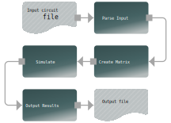

# JoSIM - 超伝導回路シミュレータ

Developers Manual for v2.6.5

## プロジェクトの状況

### Testing: v2.6.5 - Status: [](https://joeydelp.visualstudio.com/JoSIM/_build/latest?definitionId=1&branchName=testing)

### Stable: v2.6.5 - Status: [](https://joeydelp.visualstudio.com/JoSIM/_build/latest?definitionId=3&branchName=master)

## はじめに

JoSIMはIARPA（助成金：U.S. Army Research Office grant W911NF-17-1-0120）のSuperToolsの下で開発されました。

JoSIMはアナログ回路シミュレータであり、超伝導素子であるJosephson junctionを表現できる性質を持った、SPICEという文法を用いています。

JoSIMはJSIM[^1]やWRspice[^2]のようなシミュレータの代わりの役割を果たすことを意図して作られました。JoSIMはモダンなC++で書かれており、新しい超電導素子の助けになるように、そして超電導素材のJosephson効果に対する良い近似になるよう幅広いカスタマイズ性・拡張性を持たせています。

SPICE文法による回路のネットリストを表す*.cir*ファイルを入力すると、ネットリストをトランジェント解析することが出来ます。
シミュレーション結果は標準出力へのダンプ、もしくは*.csv*ファイルとしての出力が可能です。

以下がざっくりとしたJoSIMによる処理過程です。これは非常に基礎的なものであり詳細についてはドキュメントの[技術的な議論](tech_disc_jp.md) のセクションで示します。


<center></center>


## ファイル構成

JoSIMリポジトリは次のような構成になっています。ファイルとフォルダの目的を簡単に示します。


    cmake   			# CMakeスクリプト。
    docs/
        index.md		# ドキュメンテーションのホームページ。
        ...      		# その他のマークダウンページ、画像・その他のファイル。
    include/
        JoSIM			# JoSIMのヘッダファイル。
    scripts				# テスト自動化とグラフ描画のためのPython3スクリプト。
    site				# このドキュメンテーションが生成される場所。
    src/
        ...				# JoSIMのソースファイル。
    test				# 様々なサンプルが入っているフォルダ。
    README.md			# ユーザに始めてもらうための基本的なreadme。
    LICENSE				# JoSIMの利用に適用されるライセンスについて。
    CMakeLists.txt		# コードをコンパイルするためのコンフィグ。
    ...					# その他のコンフィグファイルとスクリプト。

## 初期セットアップ
メジャーなプラットフォームに対するメジャー版のJoSIMはGitHubリポジトリの[Releases](https://github.com/JoeyDelp/JoSIM/releases) にあります。これが書かれている段階のバージョンは2.5です。

JoSIMをソースからコンパイルするためには、以下のパッケージが必要になります：

- CMake 3.14
- Git
- C++ compiler with C++17 support

### ソースからのビルド
#### Linux

これからの手順は最低限のインストールがされたCentOS 7上で実行されています。その他のディストリビューションを利用している場合、それぞれに合ったディストリビューションのパッケージマネージャを利用してください。

インターネット接続と、パッケージをインストールするための動作環境が必要です。もしインターネット接続がされていない場合オンにします。<network interface>の部分は*eth0*など、利用しているインターフェースに置き換えてください。

```bash
sudo ifup <network interface>
```

CentOS 7はデフォルトで全てのLinuxエンタープライズのパッケージを含んでいるわけではないので、以下を有効化する必要があります：

```bash
sudo yum install epel-release
sudo yum update
```

CentOS 7は開発パッケージを必要とします。幸いなことにこちらはコマンド一つで済みます：

```bash
sudo yum groupinstall "Development Tools"
```

 *gcc*, *make*, *git*といった様々な開発ツールがこれでインストールされます。しかし、JoSIMはここで入ったものよりさらに新しいバージョンの*gcc*が必要です。ありがたいことに、次のように実行することでかなり簡単にインストール可能です。

```bash
sudo yum install centos-release-scl
sudo yum install devtoolset-8
scl enable devtoolset-8 bash
```

最後のコマンドは新しい*gcc* が必要となった時に毎回入力する必要があります。幸いこのようなエイリアスを使えば短くすることができます：
The last command needs to be entered whenever the newer *gcc* is needed. This can fortunately be shortened using an alias:

```bash
echo 'alias dts8="scl enable devtoolset-8 bash"' >> ~/.bashrc
```

これは*dts8*とコマンドを打つだけでdevtoolset-8環境を現在のbash上で有効化することができるということです。

いろいろなパッケージのインストールを簡単に行うためにPython3とpipを使います：

```bash
sudo install python36 python36-pip
```

これで適切なバージョンの*cmake*をインストールしてくれます：

```bash
pip3 install cmake --user
```

これでJoSIMのコンパイルの準備ができました。

JoSIMのソースは圧縮された*.tar.gz*形式またはリポジトリをcloneすることで直接ダウンロードできます。いずれの場合にしても展開するためのディレクトリまで行ってtarballまたは以下を実行してください：

```bash
git clone https://github.com/JoeyDelp/JoSIM.git
cd JoSIM
```

新しくcloneまたは展開されたJoSIMディレクトリに入り、次のコマンドを実行してください：

```bash
mkdir build
cd build
cmake ..
cmake --build . --config Release
```

これで**build**ディレクトリの中に実行可能なJoSIMが生成されます。

さらに、*libjosim* ライブラリも生成されます。このライブラリ（そしてjosim-cli）を使うためにはパスを通す必要があります。一番いい方法は：

```bash
sudo make install
```

これによってCMakeの*GNUInstallDirs*マクロが見つけた適切なインストールディレクトリの中に*josim-cli* 、*libjosim*、それを使うのに必要なヘッダファイルがインストールされます。

#### Apple macOS

Apple macOSは他のUnixシステムと非常に似ているのでほぼ同じ手順で行うことができます。ユーザによってはリポジトリのクローンやCMake・Gitのインストールをするかもしれません。必要要件はHomebrewでもMacportsでも、（Xcodeからインストールされている）標準のmacOSのコンパイラを利用してソースからコンパイルしてもインストール可能です。

Python 3はHomebrewから利用可能で、CMakeは通常pip (PyPI)からインストール可能です。

#### Microsoft Windows

Microsoft WindowsプラットフォームでJoSIMをコンパイルする方法はいくつもあります。最も簡単な方法はフリーの[Community version of Microsoft Visual Studio](https://visualstudio.microsoft.com/thank-you-downloading-visual-studio/?sku=Community&rel=16)をインストールすることです。これはCMakeで使うC++コンパイラを取得するためだけにやっています。

次にPython 3も同様に必要になります。Windows Store・Anaconda・[Miniconda](https://docs.conda.io/en/latest/miniconda.html)からインストールできます。インストール後は他システムと同様、CMakeは次のようにインストールできます：

```powershell
pip install cmake --user
```

CMakeが適切なコンパイラを見つけていることを確認するためには単純に次のようにします（MSVCのインストール後再起動が必要かもしれません）：

```powershell
cmake --help
```

ヘルプとジェネレータのリストが最後に表示されたはずです。MSVCがインストールされていて検出されていた場合、デフォルトのジェネレータとなっていることを示すためアスタリスク（*）が適切なMSVCのバージョンの隣についているはずです。

残りのステップはLinuxと同じです：

```powershell
mkdir build
cd build
cmake ..
cmake --build . --config Release
```

これで実行可能なJoSIM(*josim-cli*)とライブラリ (*josim.lib*) が**build/Release**フォルダの中に生成されます。

Unixシステムとは異なり、Windowsでは*CMake* *GNUInstallDirs*マクロを正しく補完してくれないため、もし同じようにすると*josim-cli* は**C:\usr\local\josim\bin\josim-cli**のような変な場所にインストールされる可能性があります。したがってWindowsシステム上ではコマンドによるインストールは推奨されず、むしろ*josim-cli* をパスが通っている場所までコピーまたは移動させた方がよいです。

そうするための一つの方法としては、例えば**JoSIM**のようなフォルダを**C:\\**以下に作成し、**build/Release**ディレクトリ内部から*josim-cli*と*josim.lib*ファイルを持ってきてフォルダをPATH環境に追加する、というものがあります。そのために**Win+x**キーを押すと出てくる管理者権限の**Command Prompt (Admin)**を選択し、次のコマンドを打ってエンターを押します：

```bash
SETX PATH %PATH%;C:\JoSIM
```

これで**C:\JoSIM**フォルダにパスが通り、*josim-cli* を管理者権限でないコマンドプロンプトでも使える場所に置けるようになります。

#### TimExとその他のツール

TimExのようないくつかのツールでは*josim-cli* を*josim*という名前にする必要があります。josimコマンドラインツール(*josim-cli*)は単体で実行可能なので、正しく機能するために特定のJoSIMの名前に依存しているファイルなどはどこにもないことになります。すなわち安全に名前を変えたり（TimExのような）外部ツールで必要な色々な名前の複製を作ったりすることが可能です。

Unixシステムでは以下のようにシンボリックリンクを作ることができます：

```bash
sudo ln -s /usr/local/bin/josim-cli /usr/local/bin/josim
```

ここで最初のパスはソースで、二番目は指し示している先を表しています。シンボリックリンクは単純に他の名前で*josim-cli* を取得可能にしているだけなので、もし*josim-cli*がアップデートされた場合でも、*josim*はその変更を反映しています。

Windowsの場合は単純に*josim-cli*をリネームするかコピーして新しい名前をつけるのが一番いいです。

### License
JoSIMにはMITライセンスが適用されており、これは誰でもソースの再配布が可能・無償利用可能という非常に寛容なライセンスです。MITライセンスでは、MITライセンスと著作権表示がコピーされたソフトウェアに含まれている限りは所有の範囲内での利用を認めています。


[^1]: E. S. Fang and T. Van Duzer, "A Josephson integrated circuit simulator (JSIM) for superconductive electronics application," in *Extended Abstracts of 1989 Intl. Superconductivity Electronics Conf. (ISEC '89)*, Tokyo, Japan: JSAP, pp. 407-410, 1989
[^2]: S. R. Whiteley, "WRspice Circuit Simulator" by *Whiteley Research Incorporated*. http://www.wrcad.com/wrspice.html