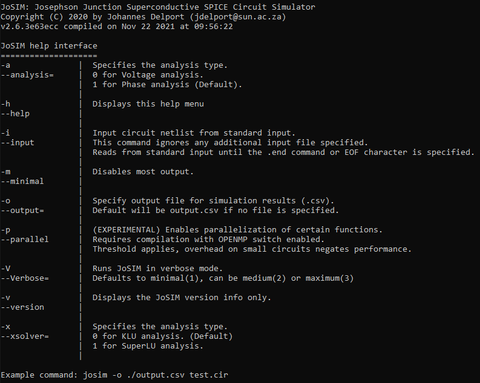

# Technical Discussion

This section of the documentation is dedicated to providing the user with better understanding of the internal operations of JoSIM.

As mentioned, this section will follow the sections of the macro overview, providing more detail to each block.

<div style="text-align:center;"></div>

## Input circuit file

JoSIM requires an input file that follows the syntax as stipulated in the [Syntax Guideline](syntax.md). This input file further requires a single [transient analysis](syntax.md#transient-analysis) command which instructs the simulation engine what to do with the rest of the input file.

This input file does not require a specific extension, but a `.cir` extension is recommended to fit with universal circuit simulation standards. 

Additionally, JoSIM allows the user the capability to feed input from standard input using the `-i` switch when running **josim-cli**. This command instructs JoSIM to read input from the command line, line by line, until the `.end` control card is received. This is ideal in a case where the output from another program is piped to **josim-cli**.

## CLI Options

When **josim-cli** is used, JoSIM needs to check and handle any command line options that the user provided before continuing to [parse the input](#parse-input). 

A CLI Options object is created from the handled command line options and fed to the input parser along with the input data.

A list of available command line options can be displayed using the `-h`, but each command what action is performed by it is discussed here.

Running `-h` produces the following:

<div style="text-align:center;"></div>

### Analysis (-a):

This command specifies which analysis type is used by JoSIM. This can be either `0` for voltage analysis or `1` for phase analysis. Phase mode has been made the default mode of analysis as of version 2.5. The differences between these methods are discussed in the [modified nodal analysis](#modified-nodal-analysis) section.

### Help (-h):

Displays the above help menu and immediately exits the program. If this command is provided with any other command, this command takes precedence.

### Input (-i):

As mentioned before, JoSIM has the capability to receive input from the command line interface (standard input) line by line. This command ignores any additional input files specified and stops reading once the .end command or an EOF (platform specific) character is received.

### Minimal (-m):

To prevent JoSIM from printing any unnecessary output to the command interface, such as progress indicators. This does not mute verbose output.

### Output (-o):

Specifies the filename and type (through extension) of the output file where results will be stored. By default, if `-o` is specified and no filename is provided, a `output.csv` file is produced. The available file formats are discussed in detail in the [output results](#output-results) section.

### Parallel (-p):

As of version 2.5 there are currently no sections of JoSIM that are parallel processed. This option, when enabled, checks whether JoSIM was compiled with `--DUSING_OPENMP=1` CMake switch. This is reserved for future implementation of very large circuits. At present, does nothing and not detrimental to performance in any scenario.

### Verbose (-V):

This enables different levels of verbosity by the simulator. Level `1` verbosity only displays statistics of the circuit being simulated. Level `2` verbosity displays all of level 1 and any evaluated `.param` statements found in the circuit. Level `3` verbosity displays level 2 and the completely expanded main design of circuit being simulated. These outputs are not muted by `-m`

### Version (-v):

Only displays the version string for **josim-cli** and then exits. This string is always displayed by default for any command. This command, however, only displays the version string.

### Solver (-x):

This option allows switching between LU solvers. Default is KLU solver. Setting this to `1` enables SuperLU solver.

## Parse Input {#parse-input}

The input data received through any of the two means above is parsed in the following steps:

<div style="text-align:center;"></div>

### Read Input

Each line in the input data is taken and cast to uppercase to avoid ambiguity. This is very important to note, **JoSIM is CaSe InSeNsItIvE**, meaning that any syntactical identifiers in the data with different case are seen as the same. Each line is further tokenized by space white spaces, this allows JoSIM to remove any ambiguity to spacing and positional info in the input data.

If the line is blank or begins with a `*` (asterisk) or `#` (hash) character, this line is ignored and not processed. Lines that begin with a `+` (plus) character are treated internally as part of the previously processed lines. In JoSIM, this means that the processed tokens from this line are added to the end of the tokens of the previous line.

Furthermore, this section handles any type of `.include` statement. This control allows for inclusion of other files immediately into the currently being processed data. This is extremely handy when a set of subcircuits that are used across multiple files (such as a cell library) are stored in a central location and simply included in each file where needed. This centralizes changes and reduces fragmentation of subcircuits. Please see the [include](syntax.md#include) section of the syntax guideline. 

### Parse Input

The list of tokens created from the previous process are now further processed by sorting each line into either controls, parameters, subcircuits or main design.

This is performed by taking a look at the first token of each item in the list. If the is a  `.subckt` or `.ends` card, this signals the start or end of a subcircuit respectively. Each line between these list items are added to a subcircuit object. If the token is a `.param` token, this list item is added to the parameters list. Lines that begin with `.model` are added to the list of models. Further, if the token starts with a `.` (period) but is not either of the above then it is a normal control and added to the controls list. Lastly, if it isn't any of the above it is added to the main design object.

Further information on any of these parts can be found in the [syntax](syntax.md) section.

### Parameters

Any identified parameters are recursively parsed until there aren't any unparsed parameters remaining. If it is exhaustively parsed but there are remaining parameters, an error is thrown for undefined parameters. 

With the proper syntax each parameter is passed to a custom implementation of Dijkstra's shunting yard algorithm[^1]. This algorithm returns the processed value and attaches it to the relevant variable name.

Parameters are unique to subcircuits, which means that during parsing a parameter is checked to see what subcircuit it belongs to. If it does not belong to any, it is seen as a global parameter. This allows subcircuits to have unique values for parameters while retaining the same variable name.

### Models

Models identified are processed and checked for syntax. If any model does not comply with recognized syntax, JoSIM halts with an error. At present the only supported model is the Josephson junction model. This is covered in the [Josephson junction](syntax.md#josephson-junction-jj) part of the syntax guide.

### Expanding Subcircuits

This section only acts to check that subcircuits are not more than 1 level deep. By this, we mean that nested subcircuits need to be flattened to a point where they are only one level deep. To achieve this, a recursive check is done to see if any subcircuit contains a list item that begins with a `X` (subcircuit identifier).  By traversing the nest to the deepest level and expanding backwards we are able to arrive at a list of subcircuits that are not nested.

The process of expansion is done by taking the device label (token that starts with an `X`) as the subcircuit name. This is then appended to all labels of the identified flattened subcircuit as well as the nodes by means of a `|` (vertical bar) followed by the name. During this process, the I/O (Input Output) nodes are identified and replaced by their respective nodes for the circuit they belong to. 

With each level the name of the parent subcircuit is appended to the name of the current subcircuit name. This is shown in detail in the [expanding main design](#expanding-main-design) section with an example.

### Expanding Main Design

Each circuit requires a main design, which is a circuit netlist that is not a subcircuit and contains some form of input and output. Any subcircuits that were flattened in the previous section are populated into the main design using the same method of appending the subcircuit name to device labels and node names.

To illustrate what is meant by this process we provide a small example. First we show a compact netlist. Note: this is purely for illustration and does not represent any form of working circuitry.

```
# Subcircuit
.subckt RLC IN OUT
R01	IN 	1 	2
L01	1	2	2pH
C01	2	OUT	2uF
.ends

# Nested subcircuit
.subckt RRLCLC IN OUT
R01	IN	1	2
X01	1	2	RLC
L01	2	3	2pH
C01	3	OUT	2uF
.ends

# Main design
V01	1	0	DC	5V
X02	1	2	RRLCLC
R01	2	0	2
.tran 0.25p 500p

```

This very basic circuit shows that there is a subcircuit that is nested within another subcircuit that is used in the main design. When expanded the main design becomes:

```
V01			1			0			DC	5V
R01|X02		1			1|X02		2
R01|X01|X02	1|X02		1|X01|X02	2
L01|X01|X02 1|X01|X02 	2|X01|X02	2PH
C01|X01|X02	2|X01|X02	2|X02		2UF
L01|X02		2|X02		3|X02		2PH
C01|X02		3|X02		2			2UF
R01			2			0			2
.TRAN	0.25P	500P
```

This might seem bizarre and rather complex but it allows each node name and label to be unique within the larger main design. This further simplifies saving results for specific devices that are nested deep within the circuit. Further information on saving results is provided in the [output](syntax.md#output) section of the syntax guide.

### Identify Simulation

Lastly, a netlist requires a simulation command to be able to do work. JoSIM only supports transient simulation method at present. This requires the presence of a `.tran` command that follows the correct syntax. See [transient simulation](syntax.md#transient-analysis) for more information on the syntax.

## Noise Insertion

As of version 2.5, JoSIM has the capability to add thermal noise to the circuit through a current source in parallel to each resistor (heat generating element). If a the `.temp` control was found in the controls list during parsing this function is triggered. This scans through the entire expanded main design, adding current sources in parallel to each resistor using the following equation[^2]:


$$
I_n=\sqrt{\frac{4k_{B}T}{R}}
$$


In this equation, `T` is the temperature provided by the `.temp` control in Kelvin, `R` is the resistance and \(k_{B}\) is the Boltzmann constant. This equation provides the noise spectral amplitude to for the noise source. Further information on [noise sources](syntax.md#noise), and the syntax thereof, can be found in the syntax guide.

It is important to note that subcircuits cannot contain a `.temp` command. A warning will be thrown and the command ignored.

## Create Matrix

The matrix creation process follows the steps set out in the overview depicted below.

<div style="text-align:center;"></div>

### Create Components

The expanded main design is iterated through, identifying the type of component each line represents through the first character. An object is created for each component storing relevant information such as the node numbers, label, value, non-zeros, etc.

A list of available components based on the first character is shown below. Any line starting with a character not listed below will cause an error and program termination.

<center>

| Character |                          Component                           |
| :-------: | :----------------------------------------------------------: |
|     B     | [Junction](syntax.md#josephson-junction-jj) (at present only Josephson) |
|     C     |               [Capacitor](syntax.md#capacitor)               |
|     E     | [Voltage Controlled Voltage Source](syntax.md#voltage-controlled-voltage-source) (VCVS) |
|     F     | [Current Controlled Current Source](syntax.md#current-controlled-current-source) (CCCS) |
|     G     | [Voltage Controlled Current Source](syntax.md#voltage-controlled-current-source) (VCCS) |
|     H     | [Current Controlled Voltage Source](syntax.md#current-controlled-voltage-source) (CCVS) |
|     I     |          [Current Source](syntax.md#current-source)          |
|     K     |       [Mutual Inductance](syntax.md#mutual-inductance)       |
|     L     |                [Inductor](syntax.md#inductor)                |
|     P     |            [Phase Source](syntax.md#phase-source)            |
|     R     |                [Resistor](syntax.md#resistor)                |
|     T     |       [Transmission Line](syntax.md#transmission-line)       |
|     V     |          [Voltage Source](syntax.md#voltage-source)          |

</center>

Syntax for each of these components can be found in the relevant sections of the syntax guide.

The matrix is set up using the [modified nodal analysis](#modified-nodal-analysis).

#### Modified nodal analysis {#modified-nodal-analysis}

There are many ways to set up a set of linear equations to solve the voltage or currents in a circuit. One of the more well known ways is to use nodal analysis which creates an equation for each node defined in the circuit netlist. This method is the basis on which the original Berkeley SPICE[^3] was built. This method, however, only calculates the voltages of every node which makes it difficult to handle components that are voltage dependent such as inductors and junctions.

This drawback led to the creation of the modified nodal analysis (MNA) which is an extension to the prior with the ability to calculating branch currents in addition to nodal voltages[^4]. We therefore make use of the MNA method to build the set of linear equations within JoSIM due to the large use of inductors as well as Josephson junctions in superconductivity.

A useful feature of the MNA method allows every component to be represented as a sub-matrix called a stamp. The summation of all the stamps provide us with the **A**, **x** as well as **b** matrices that are required to solve the linear equations. These stamps will be discussed further in the following subsection.

#### Backward Differentiation Formula

In transient analysis many components have time dependent $(\frac{d}{dt})$ voltage or current values. These differentials are not easily solvable and require special techniques to approximate the value at the requested time given previous time values. One such method is the backward differential formula (BDF)[^5], which is a linear multistep method. In circuit analysis applications, the BDF2 (2nd order) method is considered the most stable method.

This method is expressed as:


$$
\left(\frac{dx}{dt}\right)_n = \frac{3}{2h}\left[x_n - \frac{4}{3}x_{n-1} + \frac{1}{3}x_{n−2}\right]
$$


With \(h​\) as the time difference or rather time step of the simulation. This method requires knowledge of 2 prior timesteps, indicated by \(n-1\) and \(n-2\). Though this method might seem like it requires extra computation for every component, it actually simplifies components that require differentials.

We demonstrate this using the capacitor.

<div style="text-align:center;"></div>

The capacitor above has a general equation to determine the current through it as:


$$
i_{C_{1}}(t) = C_{1}\frac{dv}{dt}
$$


It is noted that this equation is time dependent and we therefore need to apply the BDF2 method:


$$
I_{C1} = \frac{3C_{1}}{2h}\left[V_{n}-\frac{4}{3}V_{n-1}+\frac{1}{3}V_{n-2}\right]
$$


We note that the $V$ is the difference in voltage across the component and taken as $V_{1} - V_{2}$. We further expand the above equation to place values of the current time step on the left hand side (LHS) and all known values on the right hand side (RHS):


$$
\frac{3C_{1}}{2h}V_{n} - I_{C_{1}} = \frac{2C_{1}}{h}V_{n-1} - \frac{C_{1}}{2h}V_{n-2}
$$

$$
V_{n} - \frac{2h}{3C_{1}}I_{C_{1}} = \frac{2h}{3C_{1}}\frac{2C_{1}}{h}V_{n-1}-\frac{2h}{3C_{1}}\frac{C_{1}}{2h}V_{n-2}
$$


$$
V_{n} - \frac{2h}{3C_{1}}I_{C_{1}} = \frac{4}{3}V_{n-1}-\frac{1}{3}V_{n-2}
$$

Which we can then write in matrix form as:


$$
\begin{bmatrix}
0 & 0 & 1 \\
0 & 0 & -1 \\
1 & -1 & -\frac{2h}{3C_{1}}
\end{bmatrix}
\begin{bmatrix}
V^{+} \\
V^{-} \\
I_{C_{1}}
\end{bmatrix}
=
\begin{bmatrix}
0 \\
0 \\
\frac{4}{3}V_{n-1}-\frac{1}{3}V_{n-2}
\end{bmatrix}
$$


The matrix above is a generic stamp that we can place into the A matrix which describes the capacitor $C_{1}$.

#### Modified nodal phase analysis

First introduced in version 2.0, the ability to perform a simulation that calculates the nodal phase instead of voltage was implemented. This new analysis method is named the modified nodal phase analysis (MNPA) and utilizes the voltage-phase[^6] relationship seen below.


$$
v = \frac{\Phi_{0}}{2\pi}\frac{d\phi}{dt}
$$


If this relationship is applied to all the component models found in JoSIM we obtain the MNPA stamps, which allow us to solve the phase directly. As example we demonstrate this on the capacitor equation shown in the previous section.


$$
I_{C1} = \frac{3C_{1}}{2h}\left[\frac{\Phi_{0}}{2\pi}\frac{d\phi}{dt}-\frac{4}{3}\frac{\Phi_{0}}{2\pi}\frac{d\phi}{dt}_{n-1}+\frac{1}{3}\frac{\Phi_{0}}{2\pi}\frac{d\phi}{dt}_{n-2}\right]
$$

$$
I_{C1} = \frac{3C_{1}}{2h}\frac{\Phi_{0}}{2\pi}\left[\frac{d\phi}{dt}-\frac{4}{3}\frac{d\phi}{dt}_{n-1}+\frac{1}{3}\frac{d\phi}{dt}_{n-2}\right]
$$

$$
\frac{2h}{3C_{1}}\frac{2\pi}{\Phi_{0}}I_{C1} = \frac{d\phi}{dt}-\frac{4}{3}\frac{d\phi}{dt}_{n-1}+\frac{1}{3}\frac{d\phi}{dt}_{n-2}
$$

$$
\frac{2h}{3C_{1}}\frac{2\pi}{\Phi_{0}}I_{C1} = \frac{3}{2h}\left[\phi_n - \frac{4}{3}\phi_{n-1}+\frac{1}{3}\phi_{n-2}\right]-\frac{4}{3}\frac{3}{2h}\left[\phi_{n-1} - \frac{4}{3}\phi_{n-2}+\frac{1}{3}\phi_{n-3}\right]+\frac{1}{3}\frac{3}{2h}\left[\phi_{n-2} - \frac{4}{3}\phi_{n-3}+\frac{1}{3}\phi_{n-4}\right]
$$

$$
\frac{2h}{3C_{1}}\frac{2\pi}{\Phi_{0}}I_{C1} = \frac{3}{2h}\phi_n - \frac{2}{h}\phi_{n-1}-\frac{2}{h}\phi_{n-1}+\frac{1}{2h}\phi_{n-2} + \frac{8}{3h}\phi_{n-2}+\frac{1}{2h}\phi_{n-2}-\frac{2}{3h}\phi_{n-3} - \frac{2}{3h}\phi_{n-3}+\frac{1}{6h}\phi_{n-4}
$$

$$
\frac{2h}{3C_{1}}\frac{2\pi}{\Phi_{0}}I_{C1} = \frac{3}{2h}\phi_n - \frac{4}{h}\phi_{n-1} + \frac{22}{6h}\phi_{n-2}-\frac{4}{3h}\phi_{n-3}+\frac{1}{6h}\phi_{n-4}
$$

$$
\phi_n - \frac{4h^{2}}{9C_{1}}\frac{2\pi}{\Phi_{0}}I_{C1} = \frac{8}{3}\phi_{n-1} - \frac{22}{9}\phi_{n-2}+\frac{8}{9}\phi_{n-3}-\frac{1}{9}\phi_{n-4}
$$


This can then be reduced to a component stamp as follows:


$$
\begin{bmatrix}
0 & 0 & 1 \\
0 & 0 & -1 \\
1 & -1 & - \frac{4h^{2}}{9C_{1}}\frac{2\pi}{\Phi_{0}}
\end{bmatrix}
\begin{bmatrix}
\phi^{+} \\
\phi^{-} \\
I_{C_{1}}
\end{bmatrix}
=
\begin{bmatrix}
0 \\
0 \\
\frac{8}{3}\phi_{n-1} - \frac{22}{9}\phi_{n-2}+\frac{8}{9}\phi_{n-3}-\frac{1}{9}\phi_{n-4}
\end{bmatrix}
$$


With this expansion it is shown, the capacitor requires up to 4 previous time step values to compute the current step.

JoSIM has been adapted to allow phase analysis on any design that works with voltage analysis without requiring alterations to the netlist file. Since the voltage is simply the scaled time derivative of the phase the voltage can be calculated as a post process if the user requests it.

As noted in the [CLI Options](#cli-options) section, the default mode for simulation is now phase as of version 2.5. 

All the MNPA stamps are included in the [Component Stamps](comp_stamps.md) section.

### Mutual Inductances

If there are any mutual inductances in the circuit then this section is triggered. When found in the previous section the mutual inductances are simply added to a list for later processing. This is done to allow all inductors to be created as objects first before the mutual inductors are applied.

This also allows us to perform a sanity check, ensuring that the inductors being coupled exist.

### Create CSR

The concept of zero is a strange thing, to humans it is nothing but to machines it is the same as all other numbers and takes up just as much memory. Since we do not want to waste memory and computation storing the number zero we use a different form of matrix representation known as the compressed row storage (CSR)[^7]. 

This data structure consists of 3 vectors, namely the non-zero (nnz), the  column indices (ci) and the row pointer (rp) vectors. The non-zero vector only stores the non-zero elements of each component. The column indices vector stores the index where each of the non-zeros are found. The row pointer stores the total number of non-zeros after each row, starting with zero. This allows the simulation engine to quickly discern which non-zero belongs in which position if the matrix were actually a full sparse matrix.

As example to demonstrate this we use the following 5x5 matrix:


$$
\begin{bmatrix}
		1 & 0 & 0 & 4 & 0\\
		0 & 3 & 0 & 0 & 0 \\
		0 & 0 & 1 & 0  & 0\\
		0& 4 & 0 & 5 & 0 \\
		0 & 0 & 0 & 0 & 1
	\end{bmatrix}
$$


Storing this matrix in system memory would take up 25 numbers. If we were to convert this to CSR format we arrive at the following 3 vectors:


$$
nnz=\left[1, 4, 3, 1, 4, 5, 1\right]
$$

$$
ci=\left[0,3,1,2,1,3,4\right]
$$

$$
rp=\left[0,2,3,4,6,7\right]
$$

This data structure only takes up 20 numbers to store. This does not seem much less than the 25 before, but this scales very significantly when working with very large circuits.

During the matrix creation part, the objects created already form these nnz, ci and rp vectors for each component. During this part all these vectors are simply collected to form the overall CSR for the circuit.

### Find Relevant Traces

Like before with the CSR instead of storing the full matrix to save memory, it would also be advantageous to not store every value computed during the simulation step for every component. To avoid this, we identify the specific traces (reference to relevant computed values)  before simulation starts.

This is done by combing the controls list for any output statements (`.print`,`.plot` or `.save`) and identifying which component or node each refer to. The relevant node and current branch indices are then stored in a list which will be used during simulation.

## Simulation

Once we have a all the component objects and a CSR representing the matrix we can perform the requested simulation. An overview of the simulation step is shown below.

<div style="text-align:center;"></div>

### Create Simulation Objects

JoSIM uses the sparse matrix solver library SuiteSparse[^8] of which the KLU solver is implemented. To use KLU specific objects need to be created using the CSR vectors. During this part these objects are created and initialized using the relevant data.

### Start Simulation

A transient simulation is synonymous to a time domain simulation, and since we are working with a digital system this time simulation needs to be discretized into a set amount of steps determined by the total simulation time divided by the step size. 

#### Create **b** Matrix

The **b** matrix is created using the known values from each component's RHS of the equation. All components are itterated through and their RHS values inserted into the **b** matrix at the correct locations before simulation is done.

#### Solve Ax=b

With both **A** and **b** known, KLU solves **x** (the unknowns) for the current step.

#### Store results

The results in **x** are iterated, storing only the relevant trace data as previously determined. 

The implementation of a transmission line in JoSIM is only a scaled time delay at present and as such the currents of and nodes connected to all transmission lines need to be stored for all time. 

Once completed, the process is repeated for the next time step until the simulation is finished.

## Output Results {#output-results}

The results from the simulation along with the time data is formatted to form  a 2D data set with a label describing each column of data.

JoSIM supports exactly 3 output formats. Each of which are determined by the extension of the file specified in the [CLI Options](#cli-options). These formats are comma separated value (CSV), space separated value (DAT) and raw SPICE output.

### CSV (.csv)

The formatted results are stored in a file with the labels at the top followed by each row of data starting with the time point. All elements in this file are comma separated. This makes it very easy to read and understand from a human perspective but as well by many software libraries for plotting. This is also the default format in the case that output was requested but no file name provided. In this case the results will be stored in a file called *output.csv*.

### DAT (.dat)

Very similar to the CSV file but instead of commas, spaces are used. This is a legacy format used as output by older simulators such as JSIM.

### RAW (no extension)

If no extension is given for the file name then a RAW SPICE file will be created. This is a very specifically formatted file that specifies the variables in a list, followed by a time step and each variable's data for that time point. This format is understood by many SPICE output plotting tools.

## Plotting interfaces

In previous versions of JoSIM there existed 2 plotting windows, namely FLTK and Matplotlib. These interfaces were, however, ultimately scrapped due to maintainability issues as well as cross-platform compatibility. The user is requested to use the plotting system they are most comfortable with. 

Below we provide a simple Python 3 script that plots all the results in a *.csv* file. It is very basic and the user should modify it as required. This script requires installation of the **Numpy** as well as **Matplotlib** packages for Python 3. Optionally, we comment the lines for use of the **Qt5** backend for plotting. The user can enable this if the **PyQt5** package is installed.

A **Plotly** and **Pandas** script is provided in the [scripts](https://github.com/JoeyDelp/JoSIM/tree/master/scripts) folder of the GitHub repository that visualizes the results in a much more elegant way, with many more settings that can be adjusted by the user.

```python
#!/usr/bin/env python
import math
# import matplotlib
# matplotlib.use('Qt5Agg')
import matplotlib.pyplot as pl
from matplotlib import gridspec
import numpy as np
import csv
import sys

time = []
data = []
labels = set()
with open(sys.argv[1], 'r') as csvFile:
    reader = csv.DictReader(csvFile)
    labels = reader.fieldnames
    data.append([])
    for row in reader:
        time.append(float(row[labels[0]]))
        for var in range(1,len(labels)):
            data.append([])
            data[var].append(float(row[labels[var]]))
csvFile.close()

N = len(labels) - 1
cols = int(math.ceil(N / 4))
rows = int(math.ceil(N / cols))

gs = gridspec.GridSpec(rows, cols)
fig = pl.figure()
for var in range(1,len(labels)):
    ax = fig.add_subplot(gs[var - 1])
    ax.plot(time, data[var])
    ax.set_xlabel(labels[0])
    ax.set_ylabel(labels[var])

fig.set_tight_layout(True)
fig.show()
input()
```

[^1]:E. W. Dijkstra, "Algol 60 translation : An Algol 60 translator for the x1 and Making a translator for Algol 60" in *MR35, Mathematisch Centrum, Amsterdam*, 1961
[^2]:J. Satchell, "Limitations on HTS single flux quantum logic," in *IEEE Transactions on Applied Superconductivity*, vol. 9, no. 2, pp. 3841-3844, June 1999, doi: 10.1109/77.783865
[^3]:L. Nagel, "Spice: A computer program to simulate computer circuits" in *University of California, Berkeley UCB/ERL Memo M520*, pp. 201-204, 1995
[^4]:C. Ho, A. Ruehli, & P. Brennan, "The modified nodal approach to network analysis" in *IEEE Transactions on circuits and systems*, vol. 22, no. 6, pp. 506-509, 1975

[^5]:C. F. Curtiss, & J. O. Hirschfelder, "Integration of stiff equations" in *Proceedings of the National Academy of Sciences*, vol. 38, no. 3, pp. 235-243, 1952
[^6]:T. P. Orlando & K. A. Delin, "Foundations of Applied Superconductivity", *Addison-Wesley Reading, MA* vol. 8, 1991
[^7]:A. Bulu, J. T. Fineman, M. Frigo, J. R. Gilbert and C. E. Leiserson, "Parallel sparse matrix-vector and matrix-transpose-vector multiplication using compressed sparse blocks" in *Proceedings of the twenty-first annual symposium on Parallelism in algorithms and architectures*, pp. 233-244, 2009
[^8]:T. A. Davis, "Direct methods for sparse linear systems", SIAM, Philadelphia, 2006